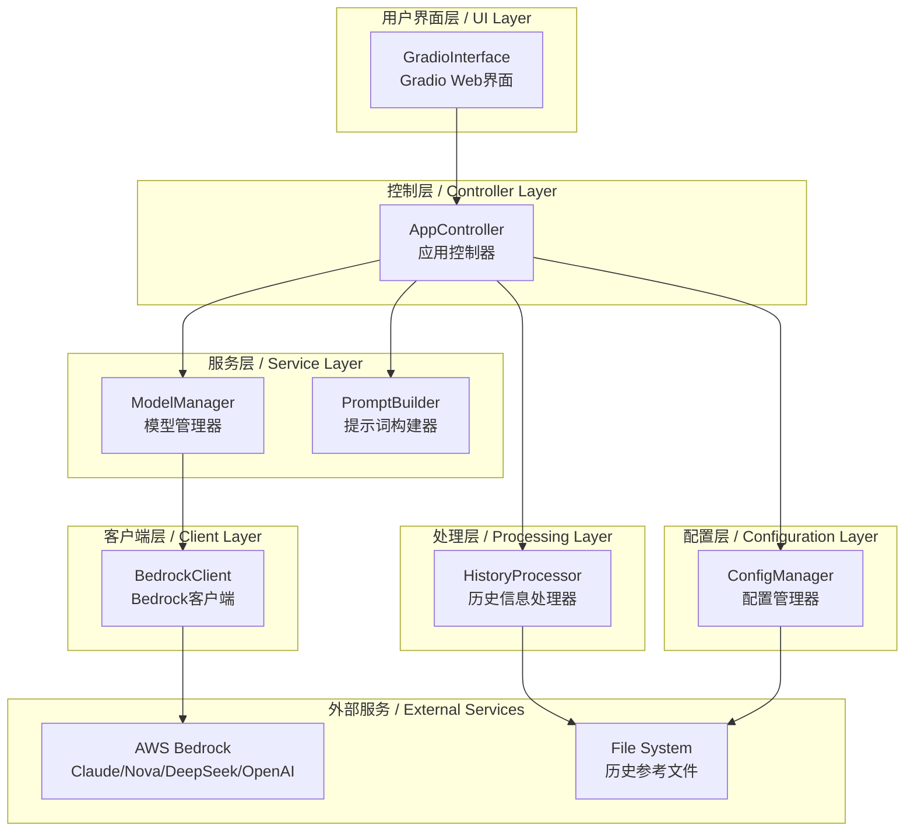
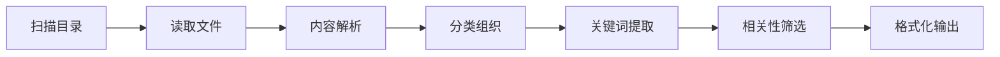
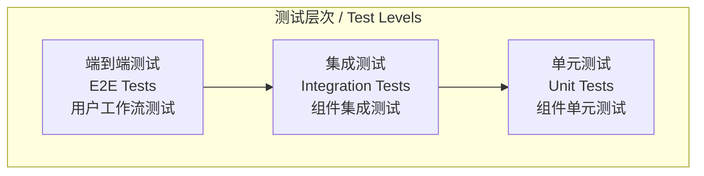

# 案例总结生成器设计文档 / Case Summary Generator Design Document

## 概述 / Overview

案例总结生成器采用分层架构设计，通过模块化的组件实现从用户输入到AI生成总结的完整流程。系统集成AWS Bedrock服务，支持多种大语言模型，并通过Gradio提供直观的Web界面。

The Case Summary Generator uses a layered architecture design, implementing the complete workflow from user input to AI-generated summaries through modular components. The system integrates AWS Bedrock services, supports multiple large language models, and provides an intuitive web interface through Gradio.

## 系统架构 / System Architecture

### 整体架构图 / Overall Architecture Diagram



### 分层架构详述 / Layered Architecture Details

#### 1. 用户界面层 (UI Layer)
- **GradioInterface**: 基于Gradio框架的Web用户界面
- **职责**: 处理用户交互、显示结果、状态管理
- **特性**: 响应式设计、实时状态更新、错误提示

#### 2. 控制层 (Controller Layer)
- **AppController**: 应用程序的核心控制器
- **职责**: 协调各组件、业务流程控制、异常处理
- **特性**: 统一的错误处理、组件生命周期管理

#### 3. 服务层 (Service Layer)
- **ModelManager**: 管理可用模型列表和模型操作
- **PromptBuilder**: 构建和格式化AI模型的输入提示词
- **职责**: 业务逻辑处理、数据转换、服务编排

#### 4. 处理层 (Processing Layer)
- **HistoryProcessor**: 处理历史参考文件
- **职责**: 文件读取、内容解析、相关性筛选
- **特性**: 多格式支持、智能筛选、编码兼容

#### 5. 客户端层 (Client Layer)
- **BedrockClient**: AWS Bedrock服务客户端
- **职责**: API调用、响应解析、错误处理
- **特性**: 多模型支持、自动重试、跨区域支持

#### 6. 配置层 (Configuration Layer)
- **ConfigManager**: 配置文件管理和验证
- **职责**: 配置加载、验证、AWS凭证管理
- **特性**: 自动配置生成、多种认证方式

## 核心组件设计 / Core Component Design

### 1. ConfigManager (配置管理器)

```python
class ConfigManager:
    """配置管理器 - 负责加载和验证应用配置"""
    
    # 核心方法
    - load_config() -> Dict[str, Any]
    - validate_aws_credentials() -> bool
    - get_boto3_session() -> boto3.Session
    - get_system_prompt() -> str
    - get_app_config() -> Dict[str, Any]
```

**设计要点:**
- 支持YAML格式配置文件
- 自动生成默认配置
- AWS凭证验证和Session创建
- 配置热重载支持

**配置结构:**
```yaml
aws:
  auth_method: "profile" | "ak_sk"
  profile_name: string
  region: string
models:
  claude: [model_configs]
  nova: [model_configs]
  deepseek: [model_configs]
  openai: [model_configs]
system_prompt: string
history_folder: string
app:
  title: string
  max_tokens: integer
  temperature: float
```

### 2. HistoryProcessor (历史信息处理器)

```python
class HistoryProcessor:
    """历史信息处理器 - 处理历史参考文件"""
    
    # 核心方法
    - load_history_files() -> List[Dict[str, str]]
    - process_history_content(files) -> str
    - filter_relevant_history(case_input, history) -> str
```

**设计要点:**
- 递归扫描目录结构
- 支持多种文件格式 (.txt, .md, .markdown)
- 智能关键词提取和匹配
- 多语言编码支持

**处理流程:**


### 3. BedrockClient (Bedrock客户端)

```python
class BedrockClient:
    """AWS Bedrock客户端 - 与AWS Bedrock服务交互"""
    
    # 核心方法
    - list_foundation_models() -> List[Dict[str, Any]]
    - filter_models_by_provider(models) -> Dict[str, List]
    - converse(model_id, messages, **kwargs) -> str
    - get_model_display_name(model_id) -> str
```

**设计要点:**
- 支持Converse API统一接口
- 自动处理推理配置文件 (Inference Profiles)
- 智能模型名称显示
- 跨区域模型支持

**支持的模型类别:**
- **Claude系列**: Claude 3/3.5/4 Sonnet/Haiku/Opus
- **Nova系列**: Nova Pro/Lite/Micro/Premier
- **DeepSeek系列**: DeepSeek V2.5/V3/R1
- **OpenAI系列**: GPT-4o/GPT-4 (如果可用)

### 4. ModelManager (模型管理器)

```python
class ModelManager:
    """模型管理器 - 管理可用模型和模型操作"""
    
    # 核心方法
    - refresh_available_models() -> Dict[str, List]
    - get_models_for_ui() -> List[Dict[str, str]]
    - is_model_available(model_id) -> bool
    - get_default_model() -> str
```

**设计要点:**
- 动态获取可用模型列表
- 模型分类和排序
- UI友好的模型显示
- 智能默认模型选择

### 5. PromptBuilder (提示词构建器)

```python
class PromptBuilder:
    """提示词构建器 - 构建AI模型输入"""
    
    # 核心方法
    - build_prompt(case_input, history_reference, system_prompt) -> str
    - format_history_context(history) -> str
    - validate_prompt_length(prompt) -> bool
```

**设计要点:**
- 结构化提示词模板
- 历史信息上下文整合
- 提示词长度控制
- 多语言支持

**提示词结构:**
```
系统提示词 (System Prompt)
↓
历史参考信息 (Historical Context)
↓
用户案例输入 (User Case Input)
↓
输出格式要求 (Output Format Requirements)
```

### 6. AppController (应用控制器)

```python
class AppController:
    """应用控制器 - 协调所有组件的核心控制器"""
    
    # 核心方法
    - initialize_models() -> Dict[str, List]
    - process_case_summary(case_input, model_id, **kwargs) -> str
    - validate_input(case_input) -> bool
    - get_initialization_status() -> Tuple[bool, str]
```

**设计要点:**
- 组件生命周期管理
- 统一异常处理
- 业务流程编排
- 状态管理

### 7. GradioInterface (Gradio界面)

```python
class GradioInterface:
    """Gradio用户界面 - Web界面组件"""
    
    # 核心方法
    - create_interface() -> gr.Blocks
    - _generate_summary(case_input, model_id, system_prompt) -> Tuple[str, str]
    - _refresh_models() -> Tuple[gr.Dropdown, str]
    - launch(**kwargs) -> None
```

**设计要点:**
- 响应式界面布局
- 实时状态反馈
- 错误处理和用户提示
- 可配置的界面主题

## 数据模型 / Data Models

### 配置数据模型 / Configuration Data Model

```python
@dataclass
class AWSConfig:
    auth_method: str  # "profile" | "ak_sk"
    profile_name: Optional[str]
    access_key_id: Optional[str]
    secret_access_key: Optional[str]
    region: str

@dataclass
class ModelConfig:
    id: str
    name: str
    provider: str  # "claude" | "nova" | "deepseek" | "openai"

@dataclass
class AppConfig:
    title: str
    max_tokens: int
    temperature: float
```

### 历史文件数据模型 / History File Data Model

```python
@dataclass
class HistoryFile:
    path: str
    name: str
    content: str
    category: str
    encoding: str
    size: int
    modified_time: datetime
```

### 模型响应数据模型 / Model Response Data Model

```python
@dataclass
class ModelResponse:
    content: str
    model_id: str
    tokens_used: int
    response_time: float
    status: str  # "success" | "error"
    error_message: Optional[str]
```

## 接口设计 / Interface Design

### REST API风格的内部接口 / REST API Style Internal Interfaces

虽然这是一个单体应用，但内部组件间采用清晰的接口设计：

```python
# 配置管理接口
class IConfigManager:
    def load_config(self) -> Dict[str, Any]: ...
    def validate_credentials(self) -> bool: ...

# 模型管理接口
class IModelManager:
    def get_available_models(self) -> Dict[str, List]: ...
    def invoke_model(self, model_id: str, prompt: str) -> str: ...

# 历史处理接口
class IHistoryProcessor:
    def load_history(self) -> List[HistoryFile]: ...
    def filter_relevant(self, query: str) -> str: ...
```

## 错误处理策略 / Error Handling Strategy

### 异常层次结构 / Exception Hierarchy

```python
class CaseSummaryError(Exception):
    """基础异常类"""
    pass

class ConfigurationError(CaseSummaryError):
    """配置相关错误"""
    pass

class AWSCredentialsError(ConfigurationError):
    """AWS凭证错误"""
    pass

class ModelInvocationError(CaseSummaryError):
    """模型调用错误"""
    pass

class HistoryProcessingError(CaseSummaryError):
    """历史处理错误"""
    pass
```

### 错误处理原则 / Error Handling Principles

1. **优雅降级**: 历史文件处理失败时继续工作
2. **用户友好**: 技术错误转换为用户可理解的消息
3. **详细日志**: 记录完整的错误上下文用于调试
4. **自动重试**: 网络相关错误自动重试
5. **状态恢复**: 错误后系统能够恢复到可用状态

## 安全设计 / Security Design

### 凭证管理 / Credential Management

```python
class SecureCredentialManager:
    """安全凭证管理"""
    
    def mask_sensitive_data(self, data: str) -> str:
        """遮蔽敏感信息用于日志"""
        
    def validate_input(self, user_input: str) -> bool:
        """验证用户输入安全性"""
        
    def sanitize_file_path(self, path: str) -> str:
        """清理文件路径防止目录遍历"""
```

### 安全措施 / Security Measures

1. **输入验证**: 所有用户输入进行安全验证
2. **路径安全**: 防止目录遍历攻击
3. **凭证保护**: AWS凭证不记录在日志中
4. **传输加密**: 使用HTTPS传输敏感数据
5. **权限控制**: 最小权限原则访问文件系统

## 性能优化 / Performance Optimization

### 缓存策略 / Caching Strategy

```python
class CacheManager:
    """缓存管理器"""
    
    def cache_model_list(self, models: List, ttl: int = 3600): ...
    def cache_history_content(self, content: str, ttl: int = 1800): ...
    def invalidate_cache(self, cache_key: str): ...
```

### 性能优化措施 / Performance Optimization Measures

1. **模型列表缓存**: 避免频繁API调用
2. **历史文件缓存**: 减少重复文件读取
3. **异步处理**: 非阻塞的UI操作
4. **内存管理**: 及时释放大对象
5. **连接池**: 复用AWS连接

## 测试策略 / Testing Strategy

### 测试金字塔 / Testing Pyramid



### 测试覆盖范围 / Test Coverage

1. **单元测试**: 每个组件的核心方法
2. **集成测试**: 组件间交互和AWS API集成
3. **端到端测试**: 完整用户工作流
4. **性能测试**: 大文件处理和并发测试
5. **安全测试**: 输入验证和权限测试

### Mock策略 / Mock Strategy

```python
# AWS服务Mock
@patch('src.clients.bedrock_client.BedrockClient')
def test_with_mocked_bedrock(mock_client):
    mock_client.converse.return_value = "测试响应"
    
# 文件系统Mock
@patch('pathlib.Path.exists')
def test_with_mocked_filesystem(mock_exists):
    mock_exists.return_value = True
```

## 部署架构 / Deployment Architecture

### 部署选项 / Deployment Options

1. **本地部署**: 开发和测试环境
2. **容器部署**: Docker容器化部署
3. **云端部署**: AWS EC2或其他云服务
4. **无服务器**: AWS Lambda + API Gateway (未来扩展)

### 配置管理 / Configuration Management

```yaml
# 环境特定配置
development:
  aws:
    region: "us-east-1"
  app:
    debug: true
    
production:
  aws:
    region: "us-west-2"
  app:
    debug: false
```

## 监控和日志 / Monitoring and Logging

### 日志策略 / Logging Strategy

```python
# 结构化日志
logger.info("模型调用", extra={
    "model_id": model_id,
    "tokens": token_count,
    "duration": response_time,
    "status": "success"
})
```

### 监控指标 / Monitoring Metrics

1. **性能指标**: 响应时间、吞吐量
2. **错误指标**: 错误率、失败类型
3. **业务指标**: 总结生成数量、模型使用分布
4. **资源指标**: CPU、内存、磁盘使用

## 扩展性设计 / Extensibility Design

### 插件架构 / Plugin Architecture

```python
class ModelProvider:
    """模型提供商接口"""
    def get_models(self) -> List[Model]: ...
    def invoke(self, model_id: str, prompt: str) -> str: ...

class HistoryProcessor:
    """历史处理器接口"""
    def process_file(self, file_path: str) -> str: ...
    def extract_keywords(self, content: str) -> List[str]: ...
```

### 未来扩展方向 / Future Extension Directions

1. **多模态支持**: 图像、音频案例处理
2. **实时协作**: 多用户同时编辑
3. **API服务**: RESTful API接口
4. **移动端**: 移动应用支持
5. **企业集成**: SSO、权限管理