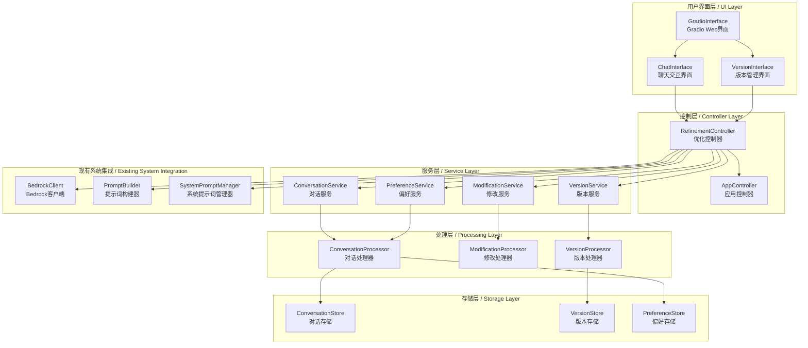

# 交互式内容优化功能设计文档 / Interactive Content Refinement Design Document

## 概述 / Overview

交互式内容优化功能是案例总结生成器的增强模块，通过聊天式界面实现用户与AI的多轮对话，支持对生成内容的精细化调整。该功能采用模块化设计，与现有系统无缝集成，提供版本管理、上下文感知和个性化学习能力。

The Interactive Content Refinement feature is an enhancement module for the Case Summary Generator that enables multi-turn conversations between users and AI through a chat-style interface, supporting fine-grained adjustments to generated content. This feature uses a modular design, seamlessly integrates with the existing system, and provides version management, context awareness, and personalized learning capabilities.

## 系统架构 / System Architecture

### 整体架构图 / Overall Architecture Diagram



### 新增组件架构详述 / New Component Architecture Details

#### 1. 聊天交互界面 (ChatInterface)
- **职责**: 提供聊天式用户界面，处理用户输入和AI响应显示
- **特性**: 实时消息流、状态指示器、消息历史滚动
- **集成点**: 嵌入到现有GradioInterface中

#### 2. 优化控制器 (RefinementController)
- **职责**: 协调交互式优化流程，管理对话状态和版本控制
- **特性**: 状态机管理、异步处理、错误恢复
- **集成点**: 与AppController协同工作

#### 3. 对话服务 (ConversationService)
- **职责**: 管理对话会话、上下文维护、消息路由
- **特性**: 上下文压缩、会话持久化、多用户支持

#### 4. 版本服务 (VersionService)
- **职责**: 内容版本管理、差异对比、版本回退
- **特性**: 增量存储、快照管理、版本树结构

#### 5. 偏好服务 (PreferenceService)
- **职责**: 用户偏好学习、模式识别、个性化建议
- **特性**: 机器学习算法、偏好模型、适应性更新

## 核心组件设计 / Core Component Design

### 1. RefinementController (优化控制器)

```python
class RefinementController:
    """交互式内容优化控制器"""
    
    def __init__(self, app_controller: AppController):
        self.app_controller = app_controller
        self.conversation_service = ConversationService()
        self.version_service = VersionService()
        self.preference_service = PreferenceService()
        self.modification_service = ModificationService()
        
    # 核心方法
    async def start_refinement_session(self, initial_content: str, user_id: str) -> str
    async def process_user_message(self, message: str, session_id: str) -> Dict[str, Any]
    async def apply_modification(self, modification: Dict, session_id: str) -> str
    def get_version_history(self, session_id: str) -> List[Dict]
    def revert_to_version(self, session_id: str, version_id: str) -> str
```

### 2. ConversationService (对话服务)

```python
class ConversationService:
    """对话管理服务"""
    
    def __init__(self):
        self.conversation_processor = ConversationProcessor()
        self.conversation_store = ConversationStore()
        
    # 核心方法
    def create_session(self, user_id: str, initial_content: str) -> str
    def add_message(self, session_id: str, message: ConversationMessage) -> None
    def get_conversation_history(self, session_id: str) -> List[ConversationMessage]
    def compress_context(self, session_id: str) -> None
    def clear_session(self, session_id: str) -> None
    
    # 上下文管理
    def get_relevant_context(self, session_id: str, query: str) -> str
    def update_context_weights(self, session_id: str, feedback: Dict) -> None
```

### 3. VersionService (版本服务)

```python
class VersionService:
    """版本管理服务"""
    
    def __init__(self):
        self.version_processor = VersionProcessor()
        self.version_store = VersionStore()
        
    # 核心方法
    def create_version(self, session_id: str, content: str, modification_type: str) -> str
    def get_version_list(self, session_id: str) -> List[ContentVersion]
    def get_version_content(self, version_id: str) -> str
    def compare_versions(self, version_id1: str, version_id2: str) -> VersionDiff
    def revert_to_version(self, session_id: str, version_id: str) -> str
    
    # 版本优化
    def cleanup_old_versions(self, session_id: str, keep_count: int = 50) -> None
    def create_milestone(self, version_id: str, description: str) -> None
```

### 4. ModificationService (修改服务)

```python
class ModificationService:
    """内容修改服务"""
    
    def __init__(self, bedrock_client: BedrockClient):
        self.bedrock_client = bedrock_client
        self.modification_processor = ModificationProcessor()
        
    # 核心方法
    async def analyze_modification_request(self, request: str, context: str) -> ModificationPlan
    async def apply_modification(self, plan: ModificationPlan, content: str) -> str
    def categorize_modification(self, request: str) -> ModificationType
    def estimate_modification_impact(self, plan: ModificationPlan) -> ImpactAssessment
    
    # 修改类型处理
    async def handle_structural_change(self, content: str, instruction: str) -> str
    async def handle_content_addition(self, content: str, instruction: str) -> str
    async def handle_style_adjustment(self, content: str, instruction: str) -> str
    async def handle_format_modification(self, content: str, instruction: str) -> str
```

## 数据存储和管理设计 / Data Storage and Management Design

### 1. 存储架构 / Storage Architecture

```python
class PreferenceStorageManager:
    """偏好存储管理器"""
    
    def __init__(self, storage_config: Dict):
        self.storage_type = storage_config.get('type', 'file_based')  # file_based, database, hybrid
        self.storage_path = storage_config.get('path', './user_preferences')
        self.encryption_enabled = storage_config.get('encryption', True)
        self.backup_enabled = storage_config.get('backup', True)
        
        # 存储结构
        self.storage_structure = {
            'user_preferences/': {
                '{user_id}/': {
                    'profile.json': '用户基本信息',
                    'prompts/': {
                        '{prompt_name}.json': '特定提示词下的偏好数据',
                        '{prompt_name}_history.json': '交互历史记录'
                    },
                    'cross_prompt_patterns.json': '跨提示词的通用模式',
                    'export_metadata.json': '导出元数据'
                }
            },
            'global_patterns/': {
                'common_preferences.json': '全局通用偏好模式',
                'learning_models.json': '机器学习模型参数'
            }
        }
```

### 2. 数据持久化方案 / Data Persistence Solution

```python
@dataclass
class PreferenceStorageSchema:
    """偏好存储模式"""
    
    # 用户偏好档案存储格式
    user_profile_schema = {
        "user_id": str,
        "created_at": str,  # ISO format
        "updated_at": str,
        "total_interactions": int,
        "active_prompts": List[str],
        "global_preferences": {
            "language": str,
            "timezone": str,
            "interaction_style": str
        }
    }
    
    # 提示词特定偏好存储格式
    prompt_preference_schema = {
        "prompt_name": str,
        "user_id": str,
        "preference_version": str,  # 用于版本控制
        "modification_preferences": {
            "structural": float,
            "content_addition": float,
            "content_removal": float,
            "style_adjustment": float,
            "format_modification": float,
            "language_optimization": float
        },
        "style_preferences": {
            "formality_level": str,
            "detail_level": str,
            "technical_depth": str,
            "tone": str,
            "sentence_length": str
        },
        "interaction_patterns": {
            "preferred_modification_size": str,  # small, medium, large
            "feedback_frequency": str,  # immediate, periodic, final
            "guidance_level": str  # minimal, moderate, detailed
        },
        "content_structure_preferences": {
            "preferred_sections": List[str],
            "section_order": List[str],
            "paragraph_length": str,
            "bullet_point_style": str
        },
        "success_metrics": {
            "total_modifications": int,
            "successful_modifications": int,
            "average_satisfaction": float,
            "improvement_trend": List[float]
        },
        "learning_metadata": {
            "confidence_score": float,
            "data_quality": str,
            "last_learning_update": str,
            "learning_stability": float
        }
    }

class PreferenceDataManager:
    """偏好数据管理器"""
    
    def __init__(self, storage_manager: PreferenceStorageManager):
        self.storage_manager = storage_manager
        self.cache = {}
        self.encryption_key = self.load_encryption_key()
        
    def save_user_preferences(self, user_id: str, prompt_name: str, 
                            preference_data: UserPreferenceProfile) -> bool:
        """保存用户偏好数据"""
        try:
            # 1. 序列化偏好数据
            serialized_data = self.serialize_preference_data(preference_data)
            
            # 2. 加密敏感数据（如果启用）
            if self.storage_manager.encryption_enabled:
                serialized_data = self.encrypt_data(serialized_data)
            
            # 3. 保存到存储
            file_path = self.get_preference_file_path(user_id, prompt_name)
            self.write_to_storage(file_path, serialized_data)
            
            # 4. 更新缓存
            self.update_cache(user_id, prompt_name, preference_data)
            
            # 5. 创建备份（如果启用）
            if self.storage_manager.backup_enabled:
                self.create_backup(user_id, prompt_name, serialized_data)
            
            return True
            
        except Exception as e:
            logging.error(f"Failed to save preferences for {user_id}/{prompt_name}: {e}")
            return False
    
    def load_user_preferences(self, user_id: str, prompt_name: str) -> Optional[UserPreferenceProfile]:
        """加载用户偏好数据"""
        try:
            # 1. 检查缓存
            cached_data = self.get_from_cache(user_id, prompt_name)
            if cached_data and self.is_cache_valid(cached_data):
                return cached_data
            
            # 2. 从存储加载
            file_path = self.get_preference_file_path(user_id, prompt_name)
            if not self.storage_exists(file_path):
                return None
            
            serialized_data = self.read_from_storage(file_path)
            
            # 3. 解密数据（如果需要）
            if self.storage_manager.encryption_enabled:
                serialized_data = self.decrypt_data(serialized_data)
            
            # 4. 反序列化
            preference_data = self.deserialize_preference_data(serialized_data)
            
            # 5. 更新缓存
            self.update_cache(user_id, prompt_name, preference_data)
            
            return preference_data
            
        except Exception as e:
            logging.error(f"Failed to load preferences for {user_id}/{prompt_name}: {e}")
            return None
```

### 3. 导出导入功能设计 / Export/Import Functionality Design

```python
class PreferenceExportImportManager:
    """偏好导出导入管理器"""
    
    def __init__(self, data_manager: PreferenceDataManager):
        self.data_manager = data_manager
        self.export_formats = ['json', 'yaml', 'csv']
        self.import_validators = {}
        
    def export_user_preferences(self, user_id: str, export_config: Dict) -> Dict[str, Any]:
        """导出用户偏好数据"""
        export_format = export_config.get('format', 'json')
        include_history = export_config.get('include_history', True)
        include_sensitive = export_config.get('include_sensitive', False)
        prompts_filter = export_config.get('prompts', None)  # None表示全部
        
        try:
            # 1. 收集用户数据
            user_data = self.collect_user_data(user_id, prompts_filter, include_history)
            
            # 2. 过滤敏感信息
            if not include_sensitive:
                user_data = self.filter_sensitive_data(user_data)
            
            # 3. 添加导出元数据
            export_metadata = {
                'export_timestamp': datetime.now().isoformat(),
                'export_version': '1.0',
                'user_id': user_id,
                'export_config': export_config,
                'data_integrity_hash': self.calculate_data_hash(user_data)
            }
            
            # 4. 格式化导出数据
            export_package = {
                'metadata': export_metadata,
                'user_profile': user_data['profile'],
                'prompt_preferences': user_data['preferences'],
                'interaction_history': user_data.get('history', []) if include_history else [],
                'cross_prompt_patterns': user_data.get('patterns', {})
            }
            
            # 5. 转换为指定格式
            formatted_data = self.format_export_data(export_package, export_format)
            
            # 6. 生成导出文件
            export_filename = f"preferences_{user_id}_{datetime.now().strftime('%Y%m%d_%H%M%S')}.{export_format}"
            
            return {
                'success': True,
                'filename': export_filename,
                'data': formatted_data,
                'metadata': export_metadata
            }
            
        except Exception as e:
            logging.error(f"Failed to export preferences for {user_id}: {e}")
            return {
                'success': False,
                'error': str(e)
            }
    
    def import_user_preferences(self, import_data: Dict, import_config: Dict) -> Dict[str, Any]:
        """导入用户偏好数据"""
        merge_strategy = import_config.get('merge_strategy', 'replace')  # replace, merge, skip_existing
        validate_integrity = import_config.get('validate_integrity', True)
        backup_existing = import_config.get('backup_existing', True)
        
        try:
            # 1. 验证导入数据格式
            validation_result = self.validate_import_data(import_data)
            if not validation_result['valid']:
                return {
                    'success': False,
                    'error': f"Invalid import data: {validation_result['errors']}"
                }
            
            # 2. 验证数据完整性
            if validate_integrity:
                integrity_check = self.verify_data_integrity(import_data)
                if not integrity_check['valid']:
                    return {
                        'success': False,
                        'error': f"Data integrity check failed: {integrity_check['error']}"
                    }
            
            user_id = import_data['metadata']['user_id']
            
            # 3. 备份现有数据（如果需要）
            if backup_existing:
                backup_result = self.backup_existing_preferences(user_id)
                if not backup_result['success']:
                    logging.warning(f"Failed to backup existing preferences: {backup_result['error']}")
            
            # 4. 处理导入策略
            import_results = []
            
            for prompt_name, preference_data in import_data['prompt_preferences'].items():
                result = self.import_prompt_preferences(
                    user_id, prompt_name, preference_data, merge_strategy
                )
                import_results.append(result)
            
            # 5. 导入跨提示词模式
            if 'cross_prompt_patterns' in import_data:
                pattern_result = self.import_cross_prompt_patterns(
                    user_id, import_data['cross_prompt_patterns']
                )
                import_results.append(pattern_result)
            
            # 6. 更新用户档案
            profile_result = self.import_user_profile(
                user_id, import_data['user_profile'], merge_strategy
            )
            import_results.append(profile_result)
            
            # 7. 统计导入结果
            successful_imports = sum(1 for r in import_results if r['success'])
            total_imports = len(import_results)
            
            return {
                'success': successful_imports > 0,
                'total_items': total_imports,
                'successful_items': successful_imports,
                'failed_items': total_imports - successful_imports,
                'details': import_results,
                'import_timestamp': datetime.now().isoformat()
            }
            
        except Exception as e:
            logging.error(f"Failed to import preferences: {e}")
            return {
                'success': False,
                'error': str(e)
            }
    
    def migrate_preferences(self, from_version: str, to_version: str, user_id: str) -> Dict[str, Any]:
        """迁移偏好数据版本"""
        migration_strategies = {
            ('1.0', '1.1'): self.migrate_v1_0_to_v1_1,
            ('1.1', '2.0'): self.migrate_v1_1_to_v2_0
        }
        
        migration_key = (from_version, to_version)
        if migration_key not in migration_strategies:
            return {
                'success': False,
                'error': f"No migration strategy found for {from_version} -> {to_version}"
            }
        
        try:
            migration_func = migration_strategies[migration_key]
            result = migration_func(user_id)
            
            return {
                'success': True,
                'migrated_version': to_version,
                'migration_details': result
            }
            
        except Exception as e:
            return {
                'success': False,
                'error': f"Migration failed: {e}"
            }
```

### 4. 用户界面集成 / User Interface Integration

```python
def create_preference_management_interface(self) -> gr.Column:
    """创建偏好管理界面"""
    with gr.Column() as preference_interface:
        gr.Markdown("## 个性化偏好管理 / Personalized Preference Management")
        
        with gr.Tab("偏好概览 / Preference Overview"):
            # 偏好统计显示
            preference_stats = gr.JSON(
                label="偏好统计 / Preference Statistics",
                value={}
            )
            
            # 学习进度显示
            learning_progress = gr.Plot(
                label="学习进度 / Learning Progress"
            )
        
        with gr.Tab("数据管理 / Data Management"):
            with gr.Row():
                with gr.Column():
                    gr.Markdown("### 导出偏好数据 / Export Preference Data")
                    
                    export_format = gr.Dropdown(
                        choices=['json', 'yaml', 'csv'],
                        value='json',
                        label="导出格式 / Export Format"
                    )
                    
                    include_history = gr.Checkbox(
                        value=True,
                        label="包含交互历史 / Include Interaction History"
                    )
                    
                    export_btn = gr.Button("导出数据 / Export Data", variant="primary")
                    export_status = gr.Textbox(label="导出状态 / Export Status")
                
                with gr.Column():
                    gr.Markdown("### 导入偏好数据 / Import Preference Data")
                    
                    import_file = gr.File(
                        label="选择导入文件 / Select Import File",
                        file_types=['.json', '.yaml', '.csv']
                    )
                    
                    merge_strategy = gr.Dropdown(
                        choices=['replace', 'merge', 'skip_existing'],
                        value='merge',
                        label="合并策略 / Merge Strategy"
                    )
                    
                    import_btn = gr.Button("导入数据 / Import Data", variant="secondary")
                    import_status = gr.Textbox(label="导入状态 / Import Status")
        
        with gr.Tab("偏好重置 / Preference Reset"):
            gr.Markdown("### ⚠️ 危险操作 / Dangerous Operations")
            
            reset_options = gr.CheckboxGroup(
                choices=[
                    "重置所有偏好 / Reset All Preferences",
                    "重置学习历史 / Reset Learning History", 
                    "重置个性化模型 / Reset Personalization Models"
                ],
                label="重置选项 / Reset Options"
            )
            
            confirm_reset = gr.Checkbox(
                label="我确认要执行重置操作 / I confirm the reset operation"
            )
            
            reset_btn = gr.Button("执行重置 / Execute Reset", variant="stop")
            reset_status = gr.Textbox(label="重置状态 / Reset Status")
        
        return preference_interface
```

## 数据模型设计 / Data Model Design

### 1. 对话相关模型 / Conversation Models

```python
@dataclass
class ConversationMessage:
    """对话消息模型"""
    id: str
    session_id: str
    sender: str  # 'user' or 'ai'
    content: str
    timestamp: datetime
    message_type: str  # 'text', 'modification_request', 'system'
    metadata: Dict[str, Any]

@dataclass
class ConversationSession:
    """对话会话模型"""
    id: str
    user_id: str
    initial_content: str
    current_content: str
    created_at: datetime
    updated_at: datetime
    status: str  # 'active', 'paused', 'completed'
    context_summary: str
    preferences: Dict[str, Any]
```

### 2. 版本相关模型 / Version Models

```python
@dataclass
class ContentVersion:
    """内容版本模型"""
    id: str
    session_id: str
    content: str
    version_number: int
    parent_version_id: Optional[str]
    modification_type: str
    modification_description: str
    created_at: datetime
    is_milestone: bool
    metadata: Dict[str, Any]

@dataclass
class VersionDiff:
    """版本差异模型"""
    version1_id: str
    version2_id: str
    additions: List[str]
    deletions: List[str]
    modifications: List[Dict[str, str]]
    similarity_score: float
```

### 3. 修改相关模型 / Modification Models

```python
@dataclass
class ModificationPlan:
    """修改计划模型"""
    id: str
    request: str
    modification_type: ModificationType
    target_sections: List[str]
    instructions: List[str]
    estimated_impact: ImpactLevel
    confidence_score: float

class ModificationType(Enum):
    """修改类型枚举"""
    STRUCTURAL = "structural"
    CONTENT_ADDITION = "content_addition"
    CONTENT_REMOVAL = "content_removal"
    STYLE_ADJUSTMENT = "style_adjustment"
    FORMAT_MODIFICATION = "format_modification"
    LANGUAGE_OPTIMIZATION = "language_optimization"

class ImpactLevel(Enum):
    """影响级别枚举"""
    LOW = "low"
    MEDIUM = "medium"
    HIGH = "high"
    CRITICAL = "critical"
```

## 用户界面优化设计 / User Interface Enhancement Design

### 1. 保守的界面集成方案 / Conservative Interface Integration Approach

基于现有已测试通过的组件，采用最小化修改的方式集成交互式优化功能：

```python
class RefinementIntegrationInterface:
    """交互式优化功能集成界面 - 保留现有组件"""
    
    def __init__(self, existing_gradio_interface: GradioInterface):
        """基于现有界面进行扩展"""
        self.existing_interface = existing_gradio_interface
        self.app_controller = existing_gradio_interface.app_controller
        
    def integrate_refinement_features(self) -> gr.Blocks:
        """在现有界面中集成优化功能"""
        
        # 保留现有的主界面结构
        with gr.Blocks(
            title=self.app_controller.get_app_config().get("title", "案例总结生成器"), 
            theme=gr.themes.Soft()
        ) as interface:
            
            # 保留现有的标题
            gr.Markdown(
                f"# {self.app_controller.get_app_config().get('title', '案例总结生成器 / Case Summary Generator')}"
            )
            
            # 保留现有的主要功能区域
            with gr.Row():
                with gr.Column(scale=2):
                    # 保留现有的案例输入区域
                    case_input = gr.Textbox(
                        label="案例输入 / Case Input",
                        placeholder="请输入需要总结的案例内容... / Please enter the case content to summarize...",
                        lines=8,
                        max_lines=15,
                    )
                    
                    # 保留现有的系统提示词管理（来自现有的prompt_ui组件）
                    with gr.Group():
                        gr.Markdown("### 系统提示词管理 / System Prompt Management")
                        prompt_selector = self.existing_interface.prompt_ui.create_prompt_selector()
                        prompt_editor = self.existing_interface.prompt_ui.create_prompt_editor()
                        
                        # 保留现有的提示词管理面板
                        (
                            management_panel,
                            new_btn,
                            save_btn,
                            delete_btn,
                            status_text,
                        ) = self.existing_interface.prompt_ui.create_prompt_management_panel()
                
                with gr.Column(scale=1):
                    # 保留现有的模型选择
                    model_dropdown = gr.Dropdown(
                        label="选择模型 / Select Model",
                        choices=[],
                        value=None,
                        interactive=True,
                    )
                    
                    # 保留现有的控制按钮
                    with gr.Row():
                        generate_btn = gr.Button(
                            "生成总结 / Generate Summary", variant="primary"
                        )
                        refresh_btn = gr.Button(
                            "刷新模型 / Refresh Models", variant="secondary"
                        )
                    
                    # 保留现有的状态显示
                    status_display = gr.Textbox(
                        label="状态 / Status",
                        value="就绪 / Ready",
                        interactive=False,
                        lines=2,
                    )
            
            # 保留现有的输出区域，并添加优化功能
            with gr.Row():
                with gr.Column(scale=2):
                    # 保留现有的输出文本框
                    output_text = gr.Textbox(
                        label="生成的案例总结 / Generated Case Summary",
                        lines=12,
                        max_lines=20,
                        interactive=False,
                    )
                
                # 新增：交互式优化区域（作为独立列）
                with gr.Column(scale=1):
                    self.create_refinement_panel()
            
            # 新增：版本管理区域（可折叠，不影响现有布局）
            with gr.Accordion("📚 版本历史 / Version History", open=False):
                self.create_version_management_panel()
            
            # 保留现有的事件绑定逻辑
            self.bind_existing_events(
                case_input, model_dropdown, prompt_editor, generate_btn, 
                refresh_btn, output_text, status_display
            )
            
            # 添加新的优化功能事件绑定
            self.bind_refinement_events()
            
        return interface
    
    def create_refinement_panel(self):
        """创建交互式优化面板"""
        gr.Markdown("### 💬 内容优化 / Content Refinement")
        
        # 聊天历史显示
        self.chat_history = gr.Chatbot(
            label="对话历史 / Chat History",
            height=300,
            show_label=True,
            bubble_full_width=False,
            avatar_images=("👤", "🤖")
        )
        
        # 用户输入区域
        with gr.Row():
            self.user_input = gr.Textbox(
                placeholder="请描述您希望的修改... / Describe your desired changes...",
                container=False,
                scale=4,
                show_label=False
            )
            self.send_btn = gr.Button("发送 / Send", variant="primary", scale=1)
        
        # 快捷操作按钮
        with gr.Row():
            self.add_detail_btn = gr.Button("➕ 添加细节", size="sm")
            self.adjust_style_btn = gr.Button("🎨 调整风格", size="sm")
            self.simplify_btn = gr.Button("✂️ 简化内容", size="sm")
        
        # 对话控制
        with gr.Row():
            self.clear_chat_btn = gr.Button("🗑️ 清空对话", size="sm")
            self.undo_btn = gr.Button("↩️ 撤销修改", size="sm")
    
    def create_version_management_panel(self):
        """创建版本管理面板"""
        with gr.Row():
            with gr.Column(scale=2):
                self.version_list = gr.Dataframe(
                    headers=["版本", "时间", "修改类型", "描述"],
                    datatype=["str", "str", "str", "str"],
                    label="版本列表 / Version List",
                    interactive=True,
                    height=150
                )
            
            with gr.Column(scale=1):
                with gr.Column():
                    self.view_version_btn = gr.Button("👁️ 查看版本", size="sm")
                    self.compare_btn = gr.Button("🔍 对比版本", size="sm")
                    self.revert_btn = gr.Button("↩️ 回退版本", size="sm")
                    self.milestone_btn = gr.Button("🏷️ 创建里程碑", size="sm")
        
        # 版本对比显示区域
        self.version_diff_display = gr.HTML(
            label="版本对比 / Version Comparison",
            visible=False
        )
    
    def bind_existing_events(self, case_input, model_dropdown, prompt_editor, 
                           generate_btn, refresh_btn, output_text, status_display):
        """绑定现有功能的事件（保持原有逻辑）"""
        
        # 保留现有的生成总结事件
        generate_btn.click(
            fn=self.existing_interface._generate_summary,
            inputs=[case_input, model_dropdown, prompt_editor],
            outputs=[output_text, status_display],
        )
        
        # 保留现有的刷新模型事件
        refresh_btn.click(
            fn=self.existing_interface._refresh_models, 
            outputs=[model_dropdown, status_display]
        )
        
        # 保留现有的界面加载事件
        # 这里会调用现有的初始化逻辑
    
    def bind_refinement_events(self):
        """绑定新的优化功能事件"""
        
        # 发送消息事件
        self.send_btn.click(
            fn=self.handle_user_message,
            inputs=[self.user_input],
            outputs=[self.chat_history, self.user_input]
        )
        
        # 快捷操作事件
        self.add_detail_btn.click(
            fn=lambda: self.handle_quick_suggestion("请添加更多细节和具体信息"),
            outputs=[self.chat_history]
        )
        
        self.adjust_style_btn.click(
            fn=lambda: self.handle_quick_suggestion("请调整语言风格，使其更加专业"),
            outputs=[self.chat_history]
        )
        
        self.simplify_btn.click(
            fn=lambda: self.handle_quick_suggestion("请简化内容，使其更加简洁明了"),
            outputs=[self.chat_history]
        )
        
        # 对话控制事件
        self.clear_chat_btn.click(
            fn=self.clear_chat_history,
            outputs=[self.chat_history]
        )
        
        # 版本管理事件
        self.view_version_btn.click(
            fn=self.view_selected_version,
            inputs=[self.version_list],
            outputs=[self.version_diff_display]
        )
        
        self.compare_btn.click(
            fn=self.compare_versions,
            inputs=[self.version_list],
            outputs=[self.version_diff_display]
        )
    
    def handle_user_message(self, message: str):
        """处理用户消息"""
        if not message.strip():
            return self.chat_history.value, ""
        
        # 添加用户消息到聊天历史
        updated_history = self.chat_history.value + [(message, None)]
        
        # 这里会调用后端的优化处理逻辑
        # ai_response = self.process_refinement_request(message)
        ai_response = f"我理解您希望：{message}。让我来帮您优化内容。"
        
        # 添加AI响应
        updated_history[-1] = (message, ai_response)
        
        return updated_history, ""  # 清空输入框
    
    def handle_quick_suggestion(self, suggestion: str):
        """处理快捷建议"""
        return self.handle_user_message(suggestion)[0]
    
    def clear_chat_history(self):
        """清空聊天历史"""
        return []
```

### 2. 个性化Prompt文件管理界面 / Personalized Prompt File Management Interface

```python
def create_personalized_prompt_management(self):
    """创建个性化prompt管理界面（作为独立标签页）"""
    
    with gr.Tab("🎯 个性化Prompt / Personalized Prompts"):
        gr.Markdown("### 个性化Prompt文件管理 / Personalized Prompt File Management")
        
        with gr.Row():
            with gr.Column(scale=1):
                # 当前用户的个性化prompt列表
                gr.Markdown("#### 📋 我的个性化Prompt / My Personalized Prompts")
                
                self.personalized_prompt_list = gr.Dataframe(
                    headers=["场景", "版本", "创建时间", "状态"],
                    datatype=["str", "str", "str", "str"],
                    label="个性化Prompt列表 / Personalized Prompt List",
                    interactive=True
                )
                
                with gr.Row():
                    self.view_prompt_btn = gr.Button("👁️ 查看", size="sm")
                    self.activate_prompt_btn = gr.Button("✅ 激活", size="sm")
                    self.delete_prompt_btn = gr.Button("🗑️ 删除", size="sm")
            
            with gr.Column(scale=2):
                # Prompt内容显示和编辑
                gr.Markdown("#### 📝 Prompt内容 / Prompt Content")
                
                self.prompt_content_display = gr.Textbox(
                    label="",
                    lines=15,
                    max_lines=20,
                    interactive=False
                )
                
                with gr.Row():
                    self.edit_prompt_btn = gr.Button("✏️ 编辑", size="sm")
                    self.save_prompt_btn = gr.Button("💾 保存", size="sm")
                    self.export_prompt_btn = gr.Button("📤 导出", size="sm")
        
        # 导入导出区域
        with gr.Accordion("📁 导入导出 / Import Export", open=False):
            with gr.Row():
                with gr.Column():
                    gr.Markdown("#### 📤 导出个性化Prompt / Export Personalized Prompts")
                    
                    self.export_format = gr.Dropdown(
                        choices=["JSON", "YAML"],
                        value="JSON",
                        label="导出格式 / Export Format"
                    )
                    
                    self.export_all_btn = gr.Button("导出全部 / Export All", variant="primary")
                    self.export_status = gr.Textbox(label="导出状态 / Export Status")
                
                with gr.Column():
                    gr.Markdown("#### 📥 导入个性化Prompt / Import Personalized Prompts")
                    
                    self.import_file = gr.File(
                        label="选择导入文件 / Select Import File",
                        file_types=['.json', '.yaml']
                    )
                    
                    self.import_btn = gr.Button("导入 / Import", variant="secondary")
                    self.import_status = gr.Textbox(label="导入状态 / Import Status")
```

### 3. 最小化修改原则 / Minimal Modification Principles

#### **保留现有组件**
1. **完全保留**现有的GradioInterface类和所有已测试的组件
2. **继承扩展**而不是重写，确保现有功能不受影响
3. **增量添加**新功能，通过新的面板和标签页实现

#### **功能集成策略**
1. **侧边面板**：将聊天优化功能作为侧边面板添加
2. **折叠区域**：版本管理等高级功能放在可折叠区域
3. **独立标签页**：个性化prompt管理作为独立标签页

#### **事件处理兼容**
1. **保持现有事件绑定**不变
2. **新增事件处理**通过新的方法实现
3. **数据流隔离**，避免影响现有数据处理逻辑

这样的设计确保了：
- ✅ 现有功能完全不受影响
- ✅ 新功能与后台服务正确对应
- ✅ 用户界面清晰易懂
- ✅ 开发风险最小化

### 1. 主界面布局重构 / Main Interface Layout Restructuring

基于功能归类和用户认知流程，重新设计主界面布局：

```python
class EnhancedGradioInterface:
    """增强的Gradio界面 - 重新组织功能布局"""
    
    def create_main_interface(self) -> gr.Blocks:
        """创建重新设计的主界面"""
        with gr.Blocks(title="智能案例总结生成器", theme=gr.themes.Soft()) as interface:
            
            # 顶部标题和状态栏
            self.create_header_section()
            
            # 主要功能区域 - 使用标签页组织
            with gr.Tabs() as main_tabs:
                
                # 标签页1: 内容生成和优化
                with gr.Tab("📝 内容生成与优化 / Content Generation & Refinement", id="generation"):
                    self.create_generation_and_refinement_section()
                
                # 标签页2: 系统配置
                with gr.Tab("⚙️ 系统配置 / System Configuration", id="configuration"):
                    self.create_configuration_section()
                
                # 标签页3: 个人偏好管理
                with gr.Tab("👤 个人偏好 / Personal Preferences", id="preferences"):
                    self.create_preference_management_section()
                
                # 标签页4: 数据管理
                with gr.Tab("💾 数据管理 / Data Management", id="data"):
                    self.create_data_management_section()
            
            # 底部状态和帮助信息
            self.create_footer_section()
            
        return interface
    
    def create_header_section(self):
        """创建顶部标题和状态栏"""
        with gr.Row():
            with gr.Column(scale=3):
                gr.Markdown("# 🤖 智能案例总结生成器 / Intelligent Case Summary Generator")
                gr.Markdown("*基于AI的交互式内容生成和优化平台 / AI-powered Interactive Content Generation and Refinement Platform*")
            
            with gr.Column(scale=1):
                # 系统状态指示器
                system_status = gr.HTML(
                    value=self.get_system_status_html(),
                    label="系统状态 / System Status"
                )
                
                # 快速操作按钮
                with gr.Row():
                    help_btn = gr.Button("❓ 帮助", size="sm")
                    settings_btn = gr.Button("⚙️ 设置", size="sm")
    
    def create_generation_and_refinement_section(self):
        """创建内容生成和优化区域"""
        with gr.Row():
            # 左侧：输入和配置区域
            with gr.Column(scale=1):
                gr.Markdown("### 📋 输入配置 / Input Configuration")
                
                # 系统提示词选择
                with gr.Group():
                    gr.Markdown("#### 🎯 系统提示词 / System Prompt")
                    prompt_selector = self.prompt_ui.create_prompt_selector()
                    
                    with gr.Row():
                        edit_prompt_btn = gr.Button("编辑 / Edit", size="sm")
                        new_prompt_btn = gr.Button("新建 / New", size="sm")
                        manage_prompts_btn = gr.Button("管理 / Manage", size="sm")
                
                # 模型选择
                with gr.Group():
                    gr.Markdown("#### 🧠 AI模型选择 / AI Model Selection")
                    model_selector = gr.Dropdown(
                        label="选择模型 / Select Model",
                        info="不同模型有不同的特点和能力 / Different models have different characteristics"
                    )
                    refresh_models_btn = gr.Button("🔄 刷新模型列表", size="sm")
                
                # 案例输入
                with gr.Group():
                    gr.Markdown("#### 📝 案例输入 / Case Input")
                    case_input = gr.Textbox(
                        label="请输入需要总结的案例内容 / Enter case content to summarize",
                        placeholder="在此输入您的案例内容... / Enter your case content here...",
                        lines=8,
                        max_lines=15
                    )
                    
                    with gr.Row():
                        word_count = gr.HTML("字数统计: 0 / Word count: 0")
                        clear_input_btn = gr.Button("清空 / Clear", size="sm")
                
                # 生成按钮
                generate_btn = gr.Button(
                    "🚀 生成案例总结 / Generate Case Summary", 
                    variant="primary", 
                    size="lg"
                )
            
            # 右侧：结果显示和优化区域
            with gr.Column(scale=2):
                gr.Markdown("### 📄 生成结果与交互优化 / Generated Results & Interactive Refinement")
                
                # 结果显示区域
                with gr.Group():
                    gr.Markdown("#### 📋 当前内容 / Current Content")
                    
                    # 内容显示和版本信息
                    with gr.Row():
                        current_version_info = gr.HTML(
                            value="<span style='color: #666;'>版本: 初始版本 / Version: Initial</span>"
                        )
                        content_stats = gr.HTML(
                            value="<span style='color: #666;'>字数: 0 | 段落: 0 / Words: 0 | Paragraphs: 0</span>"
                        )
                    
                    # 主要内容显示
                    generated_content = gr.Textbox(
                        label="",
                        lines=12,
                        max_lines=20,
                        interactive=False,
                        show_copy_button=True
                    )
                    
                    # 内容操作按钮
                    with gr.Row():
                        copy_content_btn = gr.Button("📋 复制", size="sm")
                        export_content_btn = gr.Button("💾 导出", size="sm")
                        share_content_btn = gr.Button("🔗 分享", size="sm")
                
                # 交互优化区域
                with gr.Group():
                    gr.Markdown("#### 💬 智能对话优化 / Intelligent Conversation Refinement")
                    
                    # 聊天历史显示
                    chat_history = gr.Chatbot(
                        label="",
                        height=300,
                        show_label=False,
                        bubble_full_width=False,
                        avatar_images=("👤", "🤖")
                    )
                    
                    # 用户输入区域
                    with gr.Row():
                        user_message = gr.Textbox(
                            placeholder="告诉我您希望如何改进内容... / Tell me how you'd like to improve the content...",
                            container=False,
                            scale=4,
                            show_label=False
                        )
                        send_message_btn = gr.Button("发送 / Send", variant="primary", scale=1)
                    
                    # 快捷建议按钮
                    with gr.Row():
                        gr.Markdown("**快捷建议 / Quick Suggestions:**")
                    
                    with gr.Row():
                        add_details_btn = gr.Button("➕ 添加细节", size="sm")
                        adjust_style_btn = gr.Button("🎨 调整风格", size="sm")
                        restructure_btn = gr.Button("🔄 重新组织", size="sm")
                        simplify_btn = gr.Button("✂️ 简化内容", size="sm")
                    
                    # 对话控制按钮
                    with gr.Row():
                        clear_chat_btn = gr.Button("🗑️ 清空对话", size="sm")
                        export_chat_btn = gr.Button("💾 导出对话", size="sm")
                        undo_last_btn = gr.Button("↩️ 撤销上次修改", size="sm")
        
        # 版本管理区域（可折叠）
        with gr.Accordion("📚 版本历史管理 / Version History Management", open=False):
            self.create_version_management_section()
    
    def create_version_management_section(self):
        """创建版本管理区域"""
        with gr.Row():
            with gr.Column(scale=2):
                # 版本列表
                version_history = gr.Dataframe(
                    headers=["版本", "时间", "修改类型", "描述", "满意度"],
                    datatype=["str", "str", "str", "str", "number"],
                    label="版本历史 / Version History",
                    interactive=True,
                    height=200
                )
                
                # 版本操作按钮
                with gr.Row():
                    view_version_btn = gr.Button("👁️ 查看版本", size="sm")
                    compare_versions_btn = gr.Button("🔍 对比版本", size="sm")
                    revert_version_btn = gr.Button("↩️ 回退版本", size="sm")
                    create_milestone_btn = gr.Button("🏷️ 创建里程碑", size="sm")
            
            with gr.Column(scale=1):
                # 版本统计
                version_stats = gr.Plot(
                    label="版本统计 / Version Statistics"
                )
                
                # 版本对比结果
                version_comparison = gr.HTML(
                    label="版本对比 / Version Comparison",
                    visible=False
                )
    
    def create_configuration_section(self):
        """创建系统配置区域"""
        with gr.Row():
            with gr.Column():
                gr.Markdown("### ⚙️ 系统设置 / System Settings")
                
                # AWS配置
                with gr.Group():
                    gr.Markdown("#### ☁️ AWS配置 / AWS Configuration")
                    aws_region = gr.Dropdown(
                        choices=["us-east-1", "us-west-2", "eu-west-1"],
                        label="AWS区域 / AWS Region"
                    )
                    aws_profile = gr.Textbox(label="AWS Profile")
                    test_connection_btn = gr.Button("🔗 测试连接", size="sm")
                
                # 模型参数配置
                with gr.Group():
                    gr.Markdown("#### 🎛️ 模型参数 / Model Parameters")
                    max_tokens = gr.Slider(
                        minimum=100, maximum=8000, value=4000,
                        label="最大Token数 / Max Tokens"
                    )
                    temperature = gr.Slider(
                        minimum=0.0, maximum=2.0, value=0.7, step=0.1,
                        label="创造性温度 / Temperature"
                    )
                
                # 界面设置
                with gr.Group():
                    gr.Markdown("#### 🎨 界面设置 / Interface Settings")
                    theme_selector = gr.Dropdown(
                        choices=["默认", "深色", "浅色"],
                        label="主题 / Theme"
                    )
                    language_selector = gr.Dropdown(
                        choices=["中文", "English", "中英双语"],
                        label="语言 / Language"
                    )
            
            with gr.Column():
                gr.Markdown("### 📊 系统状态 / System Status")
                
                # 系统信息
                system_info = gr.JSON(
                    label="系统信息 / System Information",
                    value={}
                )
                
                # 性能监控
                performance_metrics = gr.Plot(
                    label="性能监控 / Performance Metrics"
                )
                
                # 日志查看
                with gr.Group():
                    gr.Markdown("#### 📋 系统日志 / System Logs")
                    log_level = gr.Dropdown(
                        choices=["DEBUG", "INFO", "WARNING", "ERROR"],
                        value="INFO",
                        label="日志级别 / Log Level"
                    )
                    system_logs = gr.Textbox(
                        label="",
                        lines=8,
                        max_lines=15,
                        interactive=False
                    )
                    refresh_logs_btn = gr.Button("🔄 刷新日志", size="sm")
    
    def create_preference_management_section(self):
        """创建个人偏好管理区域"""
        with gr.Tabs():
            # 偏好概览
            with gr.Tab("📊 偏好概览 / Preference Overview"):
                with gr.Row():
                    with gr.Column():
                        # 学习进度
                        learning_progress = gr.Plot(
                            label="学习进度 / Learning Progress"
                        )
                        
                        # 偏好统计
                        preference_stats = gr.JSON(
                            label="偏好统计 / Preference Statistics"
                        )
                    
                    with gr.Column():
                        # 个性化建议
                        personalized_suggestions = gr.Markdown(
                            "### 🎯 个性化建议 / Personalized Suggestions\n\n"
                            "基于您的使用习惯，我们为您推荐... / Based on your usage patterns, we recommend..."
                        )
                        
                        # 偏好调整
                        with gr.Group():
                            gr.Markdown("#### 🎛️ 偏好调整 / Preference Adjustment")
                            
                            modification_preference = gr.Slider(
                                minimum=0, maximum=1, value=0.5,
                                label="修改倾向 / Modification Tendency"
                            )
                            
                            detail_preference = gr.Slider(
                                minimum=0, maximum=1, value=0.5,
                                label="详细程度偏好 / Detail Level Preference"
                            )
                            
                            formality_preference = gr.Slider(
                                minimum=0, maximum=1, value=0.5,
                                label="正式程度偏好 / Formality Level Preference"
                            )
            
            # 提示词偏好
            with gr.Tab("🎯 提示词偏好 / Prompt Preferences"):
                prompt_preference_selector = gr.Dropdown(
                    label="选择提示词 / Select Prompt"
                )
                
                with gr.Row():
                    with gr.Column():
                        # 当前提示词的偏好设置
                        current_prompt_preferences = gr.JSON(
                            label="当前偏好设置 / Current Preference Settings"
                        )
                        
                        # 偏好历史
                        preference_history = gr.Dataframe(
                            headers=["时间", "修改类型", "满意度", "学习效果"],
                            label="偏好学习历史 / Preference Learning History"
                        )
                    
                    with gr.Column():
                        # 偏好可视化
                        preference_radar = gr.Plot(
                            label="偏好雷达图 / Preference Radar Chart"
                        )
                        
                        # 学习建议
                        learning_suggestions = gr.Markdown(
                            "### 💡 学习建议 / Learning Suggestions"
                        )
            
            # 跨提示词分析
            with gr.Tab("🔄 跨提示词分析 / Cross-Prompt Analysis"):
                cross_prompt_analysis = gr.Plot(
                    label="跨提示词偏好对比 / Cross-Prompt Preference Comparison"
                )
                
                common_patterns = gr.JSON(
                    label="通用偏好模式 / Common Preference Patterns"
                )
    
    def create_data_management_section(self):
        """创建数据管理区域"""
        with gr.Tabs():
            # 数据导出导入
            with gr.Tab("📤📥 导出导入 / Export Import"):
                with gr.Row():
                    with gr.Column():
                        gr.Markdown("### 📤 数据导出 / Data Export")
                        
                        export_data_type = gr.CheckboxGroup(
                            choices=[
                                "偏好设置 / Preference Settings",
                                "对话历史 / Conversation History", 
                                "版本历史 / Version History",
                                "学习模型 / Learning Models"
                            ],
                            label="选择导出数据 / Select Export Data"
                        )
                        
                        export_format = gr.Dropdown(
                            choices=["JSON", "YAML", "CSV"],
                            value="JSON",
                            label="导出格式 / Export Format"
                        )
                        
                        export_btn = gr.Button("📤 导出数据", variant="primary")
                        export_status = gr.Textbox(label="导出状态 / Export Status")
                    
                    with gr.Column():
                        gr.Markdown("### 📥 数据导入 / Data Import")
                        
                        import_file = gr.File(
                            label="选择导入文件 / Select Import File",
                            file_types=['.json', '.yaml', '.csv']
                        )
                        
                        import_strategy = gr.Dropdown(
                            choices=["替换 / Replace", "合并 / Merge", "跳过现有 / Skip Existing"],
                            value="合并 / Merge",
                            label="导入策略 / Import Strategy"
                        )
                        
                        validate_before_import = gr.Checkbox(
                            value=True,
                            label="导入前验证 / Validate Before Import"
                        )
                        
                        import_btn = gr.Button("📥 导入数据", variant="secondary")
                        import_status = gr.Textbox(label="导入状态 / Import Status")
            
            # 数据备份恢复
            with gr.Tab("💾 备份恢复 / Backup Restore"):
                with gr.Row():
                    with gr.Column():
                        gr.Markdown("### 💾 数据备份 / Data Backup")
                        
                        backup_schedule = gr.Dropdown(
                            choices=["手动 / Manual", "每日 / Daily", "每周 / Weekly"],
                            label="备份计划 / Backup Schedule"
                        )
                        
                        backup_location = gr.Textbox(
                            label="备份位置 / Backup Location",
                            placeholder="./backups/"
                        )
                        
                        create_backup_btn = gr.Button("创建备份 / Create Backup")
                        
                        # 备份历史
                        backup_history = gr.Dataframe(
                            headers=["时间", "大小", "状态"],
                            label="备份历史 / Backup History"
                        )
                    
                    with gr.Column():
                        gr.Markdown("### 🔄 数据恢复 / Data Restore")
                        
                        restore_point = gr.Dropdown(
                            label="选择恢复点 / Select Restore Point"
                        )
                        
                        restore_scope = gr.CheckboxGroup(
                            choices=[
                                "用户偏好 / User Preferences",
                                "系统配置 / System Configuration",
                                "历史数据 / Historical Data"
                            ],
                            label="恢复范围 / Restore Scope"
                        )
                        
                        restore_btn = gr.Button("🔄 恢复数据", variant="stop")
                        restore_status = gr.Textbox(label="恢复状态 / Restore Status")
            
            # 数据清理
            with gr.Tab("🗑️ 数据清理 / Data Cleanup"):
                gr.Markdown("### ⚠️ 数据清理操作 / Data Cleanup Operations")
                gr.Markdown("*请谨慎操作，删除的数据无法恢复 / Please operate carefully, deleted data cannot be recovered*")
                
                cleanup_options = gr.CheckboxGroup(
                    choices=[
                        "清理过期对话 / Clean Expired Conversations",
                        "清理旧版本数据 / Clean Old Version Data",
                        "清理临时文件 / Clean Temporary Files",
                        "重置学习模型 / Reset Learning Models"
                    ],
                    label="清理选项 / Cleanup Options"
                )
                
                confirm_cleanup = gr.Checkbox(
                    label="我确认执行清理操作 / I confirm the cleanup operation"
                )
                
                cleanup_btn = gr.Button("🗑️ 执行清理", variant="stop")
                cleanup_status = gr.Textbox(label="清理状态 / Cleanup Status")
    
    def create_footer_section(self):
        """创建底部状态和帮助信息"""
        with gr.Row():
            with gr.Column(scale=2):
                gr.Markdown(
                    "---\n"
                    "💡 **使用提示**: 点击各个标签页探索不同功能，使用对话优化功能可以让AI更好地理解您的需求。\n\n"
                    "💡 **Usage Tips**: Click on different tabs to explore various features. Use conversation refinement to help AI better understand your needs."
                )
            
            with gr.Column(scale=1):
                # 快速统计
                quick_stats = gr.HTML(
                    value=self.get_quick_stats_html(),
                    label=""
                )
    
    def get_system_status_html(self) -> str:
        """获取系统状态HTML"""
        return """
        <div style="text-align: center; padding: 10px; background: #f0f8ff; border-radius: 5px;">
            <span style="color: green;">●</span> 系统正常 / System Normal<br>
            <small>AWS连接正常 / AWS Connected</small>
        </div>
        """
    
    def get_quick_stats_html(self) -> str:
        """获取快速统计HTML"""
        return """
        <div style="text-align: center; font-size: 12px; color: #666;">
            今日生成: 5 | 总对话: 23 | 偏好学习: 85%<br>
            Today: 5 | Total: 23 | Learning: 85%
        </div>
        """
```

### 2. 功能组织原则 / Functional Organization Principles

#### **信息架构设计**
1. **任务导向分组**: 按用户的主要任务流程组织功能
2. **渐进式披露**: 高频功能优先显示，高级功能折叠或分页
3. **视觉层次**: 使用颜色、图标、间距建立清晰的视觉层次
4. **上下文相关**: 相关功能就近放置，减少用户认知负担

#### **用户体验优化**
1. **一目了然**: 用户能快速理解每个区域的功能
2. **操作便捷**: 常用操作一键可达，复杂操作有清晰指引
3. **状态反馈**: 实时显示系统状态和操作结果
4. **错误预防**: 危险操作有确认机制，重要信息有备份

### 3. 响应式布局适配 / Responsive Layout Adaptation

```python
def create_responsive_layout(self):
    """创建响应式布局"""
    # 根据屏幕尺寸调整布局
    with gr.Column() as responsive_container:
        # 移动端适配
        mobile_layout = gr.Column(visible=False)
        # 桌面端布局
        desktop_layout = gr.Column(visible=True)
        
        # JavaScript检测屏幕尺寸并切换布局
        screen_size_detector = gr.HTML("""
        <script>
        function detectScreenSize() {
            const isMobile = window.innerWidth < 768;
            // 切换布局显示
            document.querySelector('[data-testid="mobile-layout"]').style.display = 
                isMobile ? 'block' : 'none';
            document.querySelector('[data-testid="desktop-layout"]').style.display = 
                isMobile ? 'none' : 'block';
        }
        window.addEventListener('resize', detectScreenSize);
        detectScreenSize();
        </script>
        """)
```

这样重新设计的界面将大大提升用户体验，确保功能的可发现性和易用性！

## 个性化偏好学习的LLM总结机制 / LLM-based Personalized Preference Learning Mechanism

### 1. 基于LLM的偏好总结和Prompt生成 / LLM-based Preference Summarization and Prompt Generation

每次用户反馈后，系统调用LLM来总结用户偏好并生成个性化prompt文件：

```python
class LLMBasedPreferenceLearning:
    """基于LLM的偏好学习引擎"""
    
    def __init__(self, bedrock_client: BedrockClient):
        self.bedrock_client = bedrock_client
        self.preference_prompt_template = """
        基于以下用户交互历史和反馈，总结用户在{prompt_name}场景下的生成偏好：

        ## 交互历史
        {interaction_history}

        ## 用户反馈
        {user_feedback}

        ## 当前偏好总结
        {current_preference_summary}

        请分析用户的偏好模式，并生成一个优化的系统提示词，包含：
        1. 用户偏好的内容风格和结构
        2. 用户常要求的修改类型
        3. 用户满意的表达方式
        4. 需要避免的内容特征

        输出格式：
        ## 偏好分析
        [分析用户偏好模式]

        ## 个性化系统提示词
        [生成的个性化提示词内容]
        """
    
    async def analyze_and_update_preference(self, user_id: str, prompt_name: str, 
                                          interaction_data: Dict) -> Dict[str, Any]:
        """分析用户交互并更新偏好"""
        
        # 1. 收集用户交互历史
        interaction_history = self.collect_interaction_history(user_id, prompt_name)
        
        # 2. 获取当前偏好总结
        current_preference = self.load_current_preference(user_id, prompt_name)
        
        # 3. 构建LLM分析提示词
        analysis_prompt = self.preference_prompt_template.format(
            prompt_name=prompt_name,
            interaction_history=self.format_interaction_history(interaction_history),
            user_feedback=self.format_user_feedback(interaction_data),
            current_preference_summary=current_preference.get('summary', '暂无偏好记录')
        )
        
        # 4. 调用LLM进行偏好分析
        llm_response = await self.bedrock_client.converse(
            model_id="anthropic.claude-3-5-sonnet-20241022-v2:0",
            messages=[{"role": "user", "content": analysis_prompt}],
            system_prompt="你是一个专业的用户偏好分析专家，擅长从用户行为中总结个性化需求。",
            max_tokens=2000,
            temperature=0.3
        )
        
        # 5. 解析LLM响应
        preference_analysis = self.parse_llm_response(llm_response)
        
        # 6. 生成个性化prompt文件
        personalized_prompt = self.create_personalized_prompt_file(
            user_id, prompt_name, preference_analysis
        )
        
        # 7. 保存偏好更新
        await self.save_preference_update(user_id, prompt_name, {
            'analysis': preference_analysis,
            'personalized_prompt': personalized_prompt,
            'update_timestamp': datetime.now().isoformat(),
            'interaction_data': interaction_data
        })
        
        return {
            'success': True,
            'preference_analysis': preference_analysis,
            'personalized_prompt_file': personalized_prompt['file_path'],
            'prompt_version': personalized_prompt['version']
        }
    
    def create_personalized_prompt_file(self, user_id: str, prompt_name: str, 
                                      preference_analysis: Dict) -> Dict[str, Any]:
        """创建个性化prompt文件"""
        
        # 1. 生成文件路径和版本
        timestamp = datetime.now().strftime('%Y%m%d_%H%M%S')
        file_name = f"{user_id}_{prompt_name}_v{timestamp}.md"
        file_path = Path(f"./personalized_prompts/{user_id}/{file_name}")
        
        # 2. 确保目录存在
        file_path.parent.mkdir(parents=True, exist_ok=True)
        
        # 3. 构建文件内容
        file_content = f"""# 个性化系统提示词 / Personalized System Prompt

## 基本信息 / Basic Information
- **用户ID**: {user_id}
- **场景**: {prompt_name}
- **版本**: {timestamp}
- **创建时间**: {datetime.now().isoformat()}

## 偏好分析 / Preference Analysis
{preference_analysis.get('analysis', '')}

## 个性化提示词 / Personalized Prompt
{preference_analysis.get('personalized_prompt', '')}

## 使用说明 / Usage Instructions
此提示词基于用户的历史交互和反馈自动生成，会随着用户使用不断优化。
This prompt is automatically generated based on user's historical interactions and feedback, and will be continuously optimized with usage.
"""
        
        # 4. 写入文件
        with open(file_path, 'w', encoding='utf-8') as f:
            f.write(file_content)
        
        # 5. 更新当前激活的个性化prompt
        self.update_active_personalized_prompt(user_id, prompt_name, file_path)
        
        return {
            'file_path': str(file_path),
            'file_name': file_name,
            'version': timestamp,
            'content': file_content
        }
    
    def load_personalized_prompt(self, user_id: str, prompt_name: str) -> Optional[str]:
        """加载用户的个性化prompt"""
        try:
            # 1. 获取当前激活的个性化prompt文件
            active_prompt_file = self.get_active_personalized_prompt_file(user_id, prompt_name)
            
            if not active_prompt_file or not Path(active_prompt_file).exists():
                return None
            
            # 2. 读取文件内容
            with open(active_prompt_file, 'r', encoding='utf-8') as f:
                content = f.read()
            
            # 3. 提取个性化提示词部分
            personalized_prompt = self.extract_personalized_prompt_from_file(content)
            
            return personalized_prompt
            
        except Exception as e:
            logging.error(f"Failed to load personalized prompt for {user_id}/{prompt_name}: {e}")
            return None
    
    def get_personalized_prompt_versions(self, user_id: str, prompt_name: str) -> List[Dict]:
        """获取个性化prompt的版本列表"""
        prompt_dir = Path(f"./personalized_prompts/{user_id}")
        if not prompt_dir.exists():
            return []
        
        versions = []
        pattern = f"{user_id}_{prompt_name}_v*.md"
        
        for file_path in prompt_dir.glob(pattern):
            version_info = self.parse_prompt_file_info(file_path)
            versions.append(version_info)
        
        # 按版本时间排序
        versions.sort(key=lambda x: x['version'], reverse=True)
        return versions
```

### 2. 个性化Prompt文件管理 / Personalized Prompt File Management

```python
class PersonalizedPromptManager:
    """个性化Prompt文件管理器"""
    
    def __init__(self, base_path: str = "./personalized_prompts"):
        self.base_path = Path(base_path)
        self.base_path.mkdir(parents=True, exist_ok=True)
        
    def export_personalized_prompts(self, user_id: str, export_format: str = 'json') -> Dict:
        """导出用户的个性化prompt文件"""
        user_dir = self.base_path / user_id
        if not user_dir.exists():
            return {'success': False, 'error': 'No personalized prompts found'}
        
        export_data = {
            'user_id': user_id,
            'export_timestamp': datetime.now().isoformat(),
            'prompts': {}
        }
        
        # 收集所有prompt文件
        for prompt_file in user_dir.glob("*.md"):
            prompt_info = self.parse_prompt_file_info(prompt_file)
            prompt_name = prompt_info['prompt_name']
            
            if prompt_name not in export_data['prompts']:
                export_data['prompts'][prompt_name] = []
            
            export_data['prompts'][prompt_name].append({
                'version': prompt_info['version'],
                'file_name': prompt_file.name,
                'content': prompt_file.read_text(encoding='utf-8'),
                'created_at': prompt_info['created_at']
            })
        
        # 生成导出文件
        export_filename = f"personalized_prompts_{user_id}_{datetime.now().strftime('%Y%m%d_%H%M%S')}.{export_format}"
        
        if export_format == 'json':
            export_content = json.dumps(export_data, ensure_ascii=False, indent=2)
        elif export_format == 'yaml':
            export_content = yaml.dump(export_data, allow_unicode=True, default_flow_style=False)
        
        return {
            'success': True,
            'filename': export_filename,
            'content': export_content,
            'data': export_data
        }
    
    def import_personalized_prompts(self, import_data: Dict, target_user_id: str = None) -> Dict:
        """导入个性化prompt文件"""
        try:
            user_id = target_user_id or import_data['user_id']
            user_dir = self.base_path / user_id
            user_dir.mkdir(parents=True, exist_ok=True)
            
            imported_count = 0
            
            for prompt_name, prompt_versions in import_data['prompts'].items():
                for version_data in prompt_versions:
                    # 重新生成文件名以避免冲突
                    new_filename = f"{user_id}_{prompt_name}_imported_{datetime.now().strftime('%Y%m%d_%H%M%S')}.md"
                    file_path = user_dir / new_filename
                    
                    # 写入文件
                    file_path.write_text(version_data['content'], encoding='utf-8')
                    imported_count += 1
            
            return {
                'success': True,
                'imported_count': imported_count,
                'target_user': user_id
            }
            
        except Exception as e:
            return {
                'success': False,
                'error': str(e)
            }
```

### 3. 集成到现有系统提示词管理 / Integration with Existing System Prompt Management

```python
class EnhancedSystemPromptManager:
    """增强的系统提示词管理器，集成个性化功能"""
    
    def __init__(self, config_manager, history_processor):
        self.config_manager = config_manager
        self.history_processor = history_processor
        self.personalized_prompt_manager = PersonalizedPromptManager()
        self.llm_preference_learning = LLMBasedPreferenceLearning(bedrock_client)
    
    def get_effective_prompt(self, user_id: str, prompt_name: str) -> str:
        """获取有效的提示词（优先使用个性化版本）"""
        
        # 1. 尝试加载个性化prompt
        personalized_prompt = self.personalized_prompt_manager.load_personalized_prompt(
            user_id, prompt_name
        )
        
        if personalized_prompt:
            return personalized_prompt
        
        # 2. 回退到基础系统提示词
        base_prompt = self.get_base_prompt(prompt_name)
        return base_prompt
    
    async def update_preference_from_feedback(self, user_id: str, prompt_name: str, 
                                           feedback_data: Dict) -> None:
        """根据用户反馈更新偏好"""
        
        # 调用LLM进行偏好分析和prompt生成
        result = await self.llm_preference_learning.analyze_and_update_preference(
            user_id, prompt_name, feedback_data
        )
        
        if result['success']:
            logging.info(f"Updated personalized prompt for {user_id}/{prompt_name}")
        else:
            logging.error(f"Failed to update personalized prompt: {result.get('error')}")
```

## 核心算法设计 / Core Algorithm Design

### 1. 上下文感知算法 / Context Awareness Algorithm

```python
class ContextAwarenessEngine:
    """上下文感知引擎"""
    
    def __init__(self):
        self.context_window_size = 10  # 保留最近10轮对话
        self.relevance_threshold = 0.7
        
    def extract_relevant_context(self, conversation_history: List[ConversationMessage], 
                               current_query: str) -> str:
        """提取相关上下文"""
        # 1. 计算消息相关性得分
        scored_messages = []
        for message in conversation_history[-self.context_window_size:]:
            relevance_score = self.calculate_relevance(message.content, current_query)
            if relevance_score > self.relevance_threshold:
                scored_messages.append((message, relevance_score))
        
        # 2. 按相关性排序并构建上下文
        scored_messages.sort(key=lambda x: x[1], reverse=True)
        context_parts = []
        
        for message, score in scored_messages[:5]:  # 最多保留5条相关消息
            context_parts.append(f"[{message.sender}]: {message.content}")
            
        return "\n".join(context_parts)
    
    def calculate_relevance(self, message_content: str, query: str) -> float:
        """计算消息与查询的相关性"""
        # 使用简单的关键词匹配和语义相似度
        # 实际实现可以使用更复杂的NLP算法
        common_words = set(message_content.lower().split()) & set(query.lower().split())
        return len(common_words) / max(len(query.split()), 1)
```

### 2. 修改意图识别算法 / Modification Intent Recognition Algorithm

```python
class ModificationIntentClassifier:
    """修改意图分类器"""
    
    def __init__(self):
        self.intent_patterns = {
            ModificationType.STRUCTURAL: [
                r"添加.*部分", r"增加.*章节", r"重新组织", r"调整结构"
            ],
            ModificationType.CONTENT_ADDITION: [
                r"详细说明", r"补充.*信息", r"添加.*内容", r"扩展"
            ],
            ModificationType.CONTENT_REMOVAL: [
                r"删除", r"移除", r"去掉", r"简化"
            ],
            ModificationType.STYLE_ADJUSTMENT: [
                r"更.*风格", r"改变语气", r"调整表达", r"更正式", r"更通俗"
            ]
        }
    
    def classify_modification_intent(self, user_request: str) -> ModificationPlan:
        """分类修改意图"""
        # 1. 模式匹配
        detected_types = []
        for mod_type, patterns in self.intent_patterns.items():
            for pattern in patterns:
                if re.search(pattern, user_request):
                    detected_types.append(mod_type)
                    break
        
        # 2. 确定主要修改类型
        primary_type = detected_types[0] if detected_types else ModificationType.CONTENT_ADDITION
        
        # 3. 提取目标区域
        target_sections = self.extract_target_sections(user_request)
        
        # 4. 生成修改指令
        instructions = self.generate_instructions(user_request, primary_type)
        
        return ModificationPlan(
            id=self.generate_plan_id(),
            request=user_request,
            modification_type=primary_type,
            target_sections=target_sections,
            instructions=instructions,
            estimated_impact=self.estimate_impact(primary_type, target_sections),
            confidence_score=0.8  # 简化的置信度计算
        )
```

### 3. 个性化偏好学习算法 / Personalized Preference Learning Algorithm

```python
@dataclass
class UserPreferenceProfile:
    """用户偏好档案"""
    user_id: str
    prompt_name: str  # 关联的系统提示词
    modification_preferences: Dict[str, float]  # 修改类型偏好权重
    style_preferences: Dict[str, Any]  # 语言风格偏好
    interaction_patterns: Dict[str, Any]  # 交互模式偏好
    content_structure_preferences: Dict[str, Any]  # 内容结构偏好
    success_history: List[Dict]  # 成功修改历史
    created_at: datetime
    updated_at: datetime

class PreferenceLearningEngine:
    """偏好学习引擎 - 支持系统提示词级别的个性化学习"""
    
    def __init__(self, system_prompt_manager):
        self.system_prompt_manager = system_prompt_manager
        # 为每个系统提示词维护独立的偏好模型
        self.prompt_preferences = {}  # {prompt_name: {user_id: UserPreferenceProfile}}
        self.learning_rate = 0.1
        self.preference_decay_rate = 0.95  # 偏好衰减率，避免过度拟合
        
    def get_user_preference_profile(self, user_id: str, prompt_name: str) -> UserPreferenceProfile:
        """获取用户在特定系统提示词下的偏好档案"""
        if prompt_name not in self.prompt_preferences:
            self.prompt_preferences[prompt_name] = {}
            
        if user_id not in self.prompt_preferences[prompt_name]:
            # 创建新的偏好档案
            self.prompt_preferences[prompt_name][user_id] = UserPreferenceProfile(
                user_id=user_id,
                prompt_name=prompt_name,
                modification_preferences=self.initialize_modification_preferences(),
                style_preferences=self.initialize_style_preferences(),
                interaction_patterns=self.initialize_interaction_patterns(),
                content_structure_preferences=self.initialize_structure_preferences(),
                success_history=[],
                created_at=datetime.now(),
                updated_at=datetime.now()
            )
        
        return self.prompt_preferences[prompt_name][user_id]
    
    def update_preferences_from_interaction(self, user_id: str, prompt_name: str, 
                                          interaction_data: Dict) -> None:
        """从用户交互中更新偏好"""
        profile = self.get_user_preference_profile(user_id, prompt_name)
        
        # 1. 更新修改类型偏好
        if 'modification_type' in interaction_data:
            mod_type = interaction_data['modification_type']
            success_score = interaction_data.get('user_satisfaction', 0.5)
            
            current_weight = profile.modification_preferences.get(mod_type, 0.5)
            new_weight = current_weight + self.learning_rate * (success_score - current_weight)
            profile.modification_preferences[mod_type] = new_weight
        
        # 2. 更新语言风格偏好
        if 'style_feedback' in interaction_data:
            style_data = interaction_data['style_feedback']
            for style_aspect, preference in style_data.items():
                profile.style_preferences[style_aspect] = preference
        
        # 3. 更新交互模式偏好
        if 'interaction_pattern' in interaction_data:
            pattern = interaction_data['interaction_pattern']
            profile.interaction_patterns[pattern['type']] = pattern['effectiveness']
        
        # 4. 记录成功历史
        if interaction_data.get('success', False):
            profile.success_history.append({
                'timestamp': datetime.now(),
                'modification_type': interaction_data.get('modification_type'),
                'satisfaction_score': interaction_data.get('user_satisfaction', 0.5),
                'content_length_before': interaction_data.get('content_length_before'),
                'content_length_after': interaction_data.get('content_length_after'),
                'modification_complexity': interaction_data.get('complexity_score', 0.5)
            })
        
        # 5. 应用偏好衰减，避免过度拟合
        self.apply_preference_decay(profile)
        
        profile.updated_at = datetime.now()
    
    def generate_personalized_guidance(self, user_id: str, prompt_name: str, 
                                     current_content: str, context: str) -> Dict[str, Any]:
        """为后续生成提供个性化指引"""
        profile = self.get_user_preference_profile(user_id, prompt_name)
        
        guidance = {
            'preferred_modification_types': self.get_top_preferred_modifications(profile),
            'style_guidance': self.generate_style_guidance(profile, current_content),
            'structure_suggestions': self.generate_structure_suggestions(profile, current_content),
            'interaction_recommendations': self.generate_interaction_recommendations(profile),
            'proactive_suggestions': self.generate_proactive_suggestions(profile, current_content, context)
        }
        
        return guidance
    
    def get_top_preferred_modifications(self, profile: UserPreferenceProfile) -> List[Dict]:
        """获取用户最偏好的修改类型"""
        sorted_prefs = sorted(
            profile.modification_preferences.items(), 
            key=lambda x: x[1], 
            reverse=True
        )
        
        return [
            {
                'type': mod_type,
                'weight': weight,
                'description': self.get_modification_description(mod_type)
            }
            for mod_type, weight in sorted_prefs[:3] if weight > 0.6
        ]
    
    def generate_style_guidance(self, profile: UserPreferenceProfile, content: str) -> Dict[str, Any]:
        """生成语言风格指引"""
        style_prefs = profile.style_preferences
        
        guidance = {
            'formality_level': style_prefs.get('formality', 'balanced'),  # formal/informal/balanced
            'detail_level': style_prefs.get('detail_preference', 'moderate'),  # detailed/concise/moderate
            'technical_depth': style_prefs.get('technical_depth', 'appropriate'),  # deep/surface/appropriate
            'tone': style_prefs.get('tone', 'professional'),  # professional/friendly/authoritative
            'preferred_sentence_length': style_prefs.get('sentence_length', 'mixed')  # short/long/mixed
        }
        
        # 基于当前内容分析，提供具体建议
        current_style = self.analyze_current_style(content)
        guidance['adjustment_suggestions'] = self.compare_styles(current_style, style_prefs)
        
        return guidance
    
    def generate_proactive_suggestions(self, profile: UserPreferenceProfile, 
                                     current_content: str, context: str) -> List[str]:
        """生成主动建议"""
        suggestions = []
        
        # 基于历史成功模式生成建议
        successful_patterns = self.analyze_success_patterns(profile.success_history)
        
        for pattern in successful_patterns:
            if self.is_pattern_applicable(pattern, current_content, context):
                suggestion = self.generate_suggestion_from_pattern(pattern, current_content)
                suggestions.append(suggestion)
        
        # 基于系统提示词特性生成建议
        prompt_specific_suggestions = self.generate_prompt_specific_suggestions(
            profile.prompt_name, current_content, profile
        )
        suggestions.extend(prompt_specific_suggestions)
        
        return suggestions[:5]  # 最多返回5个主动建议
    
    def cross_prompt_learning(self, user_id: str) -> None:
        """跨系统提示词的偏好学习"""
        user_profiles = []
        
        # 收集用户在所有系统提示词下的偏好档案
        for prompt_name, prompt_users in self.prompt_preferences.items():
            if user_id in prompt_users:
                user_profiles.append(prompt_users[user_id])
        
        if len(user_profiles) < 2:
            return  # 需要至少2个档案才能进行跨提示词学习
        
        # 识别通用偏好模式
        common_patterns = self.identify_common_patterns(user_profiles)
        
        # 将通用模式应用到偏好较少的档案中
        for profile in user_profiles:
            if len(profile.success_history) < 5:  # 经验较少的档案
                self.apply_common_patterns(profile, common_patterns)
    
    def generate_learning_insights(self, user_id: str, prompt_name: str) -> Dict[str, Any]:
        """生成学习洞察报告"""
        profile = self.get_user_preference_profile(user_id, prompt_name)
        
        insights = {
            'preference_summary': {
                'dominant_modification_types': self.get_top_preferred_modifications(profile),
                'style_profile': profile.style_preferences,
                'interaction_efficiency': self.calculate_interaction_efficiency(profile)
            },
            'learning_progress': {
                'total_interactions': len(profile.success_history),
                'success_rate': self.calculate_success_rate(profile),
                'preference_stability': self.calculate_preference_stability(profile)
            },
            'recommendations': {
                'optimization_suggestions': self.generate_optimization_suggestions(profile),
                'learning_opportunities': self.identify_learning_opportunities(profile)
            }
        }
        
        return insights
```

## 性能优化设计 / Performance Optimization Design

### 1. 异步处理架构 / Asynchronous Processing Architecture

```python
class AsyncRefinementProcessor:
    """异步优化处理器"""
    
    def __init__(self):
        self.task_queue = asyncio.Queue()
        self.worker_pool = []
        self.max_workers = 5
        
    async def start_workers(self):
        """启动工作线程池"""
        for i in range(self.max_workers):
            worker = asyncio.create_task(self.worker_loop(f"worker-{i}"))
            self.worker_pool.append(worker)
    
    async def worker_loop(self, worker_id: str):
        """工作线程循环"""
        while True:
            try:
                task = await self.task_queue.get()
                await self.process_task(task)
                self.task_queue.task_done()
            except Exception as e:
                logging.error(f"Worker {worker_id} error: {e}")
    
    async def submit_modification_task(self, task: ModificationTask) -> str:
        """提交修改任务"""
        await self.task_queue.put(task)
        return task.id
```

### 2. 缓存策略 / Caching Strategy

```python
class RefinementCache:
    """优化功能缓存"""
    
    def __init__(self):
        self.conversation_cache = {}
        self.version_cache = {}
        self.preference_cache = {}
        self.cache_ttl = 3600  # 1小时过期
        
    def cache_conversation(self, session_id: str, conversation: ConversationSession):
        """缓存对话会话"""
        self.conversation_cache[session_id] = {
            'data': conversation,
            'timestamp': time.time()
        }
    
    def get_cached_conversation(self, session_id: str) -> Optional[ConversationSession]:
        """获取缓存的对话会话"""
        if session_id in self.conversation_cache:
            cache_entry = self.conversation_cache[session_id]
            if time.time() - cache_entry['timestamp'] < self.cache_ttl:
                return cache_entry['data']
            else:
                del self.conversation_cache[session_id]
        return None
```

## 错误处理和恢复 / Error Handling and Recovery

### 1. 错误分类和处理策略 / Error Classification and Handling Strategy

```python
class RefinementErrorHandler:
    """优化功能错误处理器"""
    
    def __init__(self):
        self.error_handlers = {
            ConversationError: self.handle_conversation_error,
            VersionError: self.handle_version_error,
            ModificationError: self.handle_modification_error,
            PreferenceError: self.handle_preference_error
        }
    
    async def handle_error(self, error: Exception, context: Dict) -> ErrorResponse:
        """统一错误处理入口"""
        error_type = type(error)
        if error_type in self.error_handlers:
            return await self.error_handlers[error_type](error, context)
        else:
            return await self.handle_unknown_error(error, context)
    
    async def handle_conversation_error(self, error: ConversationError, context: Dict) -> ErrorResponse:
        """处理对话相关错误"""
        if isinstance(error, ConversationTimeoutError):
            # 尝试恢复对话状态
            session_id = context.get('session_id')
            if session_id:
                await self.recover_conversation_state(session_id)
            
        return ErrorResponse(
            error_code="CONVERSATION_ERROR",
            message="对话处理出现问题，已尝试自动恢复",
            recovery_action="retry_last_message"
        )
```

### 2. 状态恢复机制 / State Recovery Mechanism

```python
class StateRecoveryManager:
    """状态恢复管理器"""
    
    def __init__(self):
        self.checkpoint_interval = 300  # 5分钟创建一次检查点
        self.recovery_strategies = {}
        
    async def create_checkpoint(self, session_id: str):
        """创建状态检查点"""
        session_state = await self.get_session_state(session_id)
        checkpoint = {
            'session_id': session_id,
            'timestamp': time.time(),
            'conversation_state': session_state.conversation,
            'version_state': session_state.versions,
            'preference_state': session_state.preferences
        }
        await self.save_checkpoint(checkpoint)
    
    async def recover_from_checkpoint(self, session_id: str) -> bool:
        """从检查点恢复状态"""
        try:
            checkpoint = await self.load_latest_checkpoint(session_id)
            if checkpoint:
                await self.restore_session_state(session_id, checkpoint)
                return True
        except Exception as e:
            logging.error(f"Failed to recover from checkpoint: {e}")
        return False
```

## 安全性设计 / Security Design

### 1. 输入验证和清理 / Input Validation and Sanitization

```python
class InputValidator:
    """输入验证器"""
    
    def __init__(self):
        self.max_message_length = 2000
        self.forbidden_patterns = [
            r'<script.*?>.*?</script>',
            r'javascript:',
            r'on\w+\s*=',
        ]
    
    def validate_user_message(self, message: str) -> ValidationResult:
        """验证用户消息"""
        # 长度检查
        if len(message) > self.max_message_length:
            return ValidationResult(False, "消息长度超出限制")
        
        # 恶意内容检查
        for pattern in self.forbidden_patterns:
            if re.search(pattern, message, re.IGNORECASE):
                return ValidationResult(False, "消息包含不安全内容")
        
        # HTML标签清理
        cleaned_message = self.sanitize_html(message)
        
        return ValidationResult(True, "验证通过", cleaned_message)
```

### 2. 数据加密和隐私保护 / Data Encryption and Privacy Protection

```python
class PrivacyProtectionManager:
    """隐私保护管理器"""
    
    def __init__(self, encryption_key: str):
        self.encryption_key = encryption_key
        self.cipher = Fernet(encryption_key.encode())
    
    def encrypt_sensitive_data(self, data: Dict) -> str:
        """加密敏感数据"""
        json_data = json.dumps(data)
        encrypted_data = self.cipher.encrypt(json_data.encode())
        return base64.b64encode(encrypted_data).decode()
    
    def decrypt_sensitive_data(self, encrypted_data: str) -> Dict:
        """解密敏感数据"""
        encrypted_bytes = base64.b64decode(encrypted_data.encode())
        decrypted_data = self.cipher.decrypt(encrypted_bytes)
        return json.loads(decrypted_data.decode())
```

## 测试策略 / Testing Strategy

### 1. 单元测试设计 / Unit Testing Design

```python
class TestRefinementController(unittest.TestCase):
    """优化控制器单元测试"""
    
    def setUp(self):
        self.mock_app_controller = Mock()
        self.refinement_controller = RefinementController(self.mock_app_controller)
    
    async def test_start_refinement_session(self):
        """测试启动优化会话"""
        initial_content = "测试内容"
        user_id = "test_user"
        
        session_id = await self.refinement_controller.start_refinement_session(
            initial_content, user_id
        )
        
        self.assertIsNotNone(session_id)
        self.assertTrue(session_id.startswith("session_"))
    
    async def test_process_user_message(self):
        """测试处理用户消息"""
        # 设置测试数据
        session_id = "test_session"
        message = "请添加风险评估部分"
        
        # 执行测试
        result = await self.refinement_controller.process_user_message(
            message, session_id
        )
        
        # 验证结果
        self.assertIn('response', result)
        self.assertIn('modified_content', result)
```

### 2. 集成测试设计 / Integration Testing Design

```python
class TestRefinementIntegration(unittest.TestCase):
    """优化功能集成测试"""
    
    def setUp(self):
        self.app_controller = AppController("test_config.yaml")
        self.refinement_controller = RefinementController(self.app_controller)
    
    async def test_end_to_end_refinement_flow(self):
        """测试端到端优化流程"""
        # 1. 启动会话
        session_id = await self.refinement_controller.start_refinement_session(
            "初始内容", "test_user"
        )
        
        # 2. 发送修改请求
        result = await self.refinement_controller.process_user_message(
            "请添加结论部分", session_id
        )
        
        # 3. 验证版本创建
        versions = self.refinement_controller.get_version_history(session_id)
        self.assertEqual(len(versions), 2)  # 初始版本 + 修改版本
        
        # 4. 测试版本回退
        reverted_content = self.refinement_controller.revert_to_version(
            session_id, versions[0]['id']
        )
        self.assertEqual(reverted_content, "初始内容")
```

## 部署和监控 / Deployment and Monitoring

### 1. 部署配置 / Deployment Configuration

```yaml
# 优化功能配置
refinement:
  # 对话管理配置
  conversation:
    max_sessions_per_user: 5
    session_timeout: 3600  # 1小时
    max_messages_per_session: 100
    context_window_size: 10
  
  # 版本管理配置
  version:
    max_versions_per_session: 50
    auto_cleanup_enabled: true
    milestone_retention_days: 30
  
  # 性能配置
  performance:
    max_concurrent_modifications: 10
    cache_ttl: 3600
    async_processing_enabled: true
  
  # 安全配置
  security:
    input_validation_enabled: true
    max_message_length: 2000
    encryption_enabled: true
```

### 2. 监控指标 / Monitoring Metrics

```python
class RefinementMetrics:
    """优化功能监控指标"""
    
    def __init__(self):
        self.metrics = {
            'active_sessions': 0,
            'total_messages_processed': 0,
            'successful_modifications': 0,
            'failed_modifications': 0,
            'average_response_time': 0.0,
            'cache_hit_rate': 0.0,
            'user_satisfaction_score': 0.0
        }
    
    def record_message_processed(self, processing_time: float):
        """记录消息处理指标"""
        self.metrics['total_messages_processed'] += 1
        self.update_average_response_time(processing_time)
    
    def record_modification_result(self, success: bool):
        """记录修改结果指标"""
        if success:
            self.metrics['successful_modifications'] += 1
        else:
            self.metrics['failed_modifications'] += 1
```

这个设计文档详细描述了交互式内容优化功能的完整架构，包括系统集成、核心算法、用户界面、性能优化、安全性和测试策略。该设计确保了功能的可扩展性、可维护性和与现有系统的无缝集成。