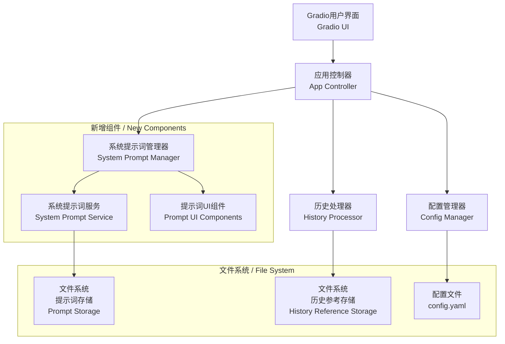
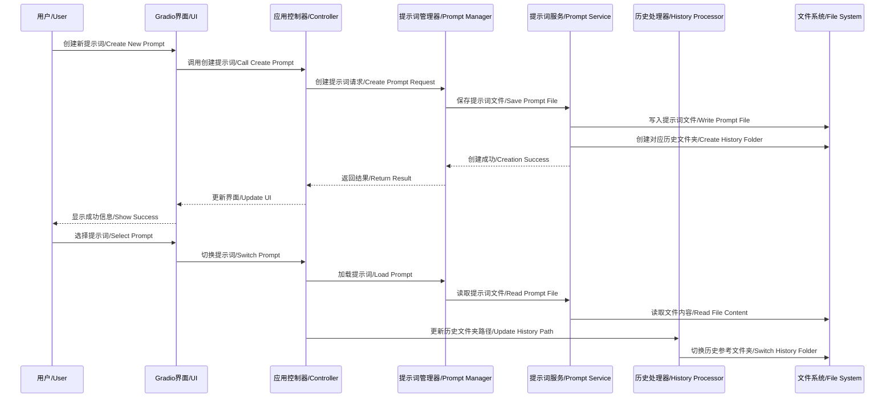

# 设计文档 / Design Document

## 概述 / Overview

系统提示词管理功能是对现有案例总结生成器的重要扩展，它允许用户创建、存储和管理多个系统提示词，并为每个提示词自动管理对应的历史参考文件。该功能采用模块化设计，与现有的配置管理、UI界面和历史处理系统无缝集成。

## 架构 / Architecture

### 系统架构图 / System Architecture Diagram



### 数据流图 / Data Flow Diagram



## 组件和接口 / Components and Interfaces

### 1. 系统提示词管理器 (SystemPromptManager)

**职责 / Responsibilities:**
- 协调系统提示词的创建、读取、更新、删除操作
- 管理提示词与历史参考文件夹的关联关系
- 提供统一的提示词管理接口

**主要方法 / Main Methods:**
```python
class SystemPromptManager:
    def __init__(self, config_manager: ConfigManager, history_processor: HistoryProcessor)
    def create_prompt(self, name: str, content: str) -> bool
    def get_prompt(self, name: str) -> Optional[str]
    def update_prompt(self, name: str, content: str) -> bool
    def delete_prompt(self, name: str) -> bool
    def list_prompts(self) -> List[Dict[str, Any]]
    def set_active_prompt(self, name: str) -> bool
    def get_active_prompt(self) -> Optional[Dict[str, str]]
    def get_prompt_history_folder(self, name: str) -> str
```

### 2. 系统提示词服务 (SystemPromptService)

**职责 / Responsibilities:**
- 处理提示词文件的底层存储操作
- 管理提示词文件夹结构
- 自动创建和管理对应的历史参考文件夹

**主要方法 / Main Methods:**
```python
class SystemPromptService:
    def __init__(self, prompts_folder: str, history_base_folder: str)
    def save_prompt_file(self, name: str, content: str) -> bool
    def load_prompt_file(self, name: str) -> Optional[str]
    def delete_prompt_file(self, name: str) -> bool
    def list_prompt_files(self) -> List[str]
    def create_history_folder(self, prompt_name: str) -> str
    def validate_prompt_name(self, name: str) -> bool
    def sanitize_folder_name(self, name: str) -> str
```

### 3. 提示词UI组件 (PromptUIComponents)

**职责 / Responsibilities:**
- 提供系统提示词管理的用户界面组件
- 集成到现有的Gradio界面中
- 处理用户交互和界面更新

**主要组件 / Main Components:**
```python
class PromptUIComponents:
    def create_prompt_selector(self) -> gr.Dropdown
    def create_prompt_editor(self) -> gr.Textbox
    def create_prompt_management_panel(self) -> gr.Column
    def create_new_prompt_dialog(self) -> gr.Modal
    def handle_prompt_selection(self, prompt_name: str) -> Tuple[str, str]
    def handle_prompt_creation(self, name: str, content: str) -> str
    def handle_prompt_update(self, name: str, content: str) -> str
    def handle_prompt_deletion(self, name: str) -> str
```

### 4. 扩展的历史处理器 (Enhanced HistoryProcessor)

**职责 / Responsibilities:**
- 支持动态切换历史参考文件夹
- 根据当前选中的系统提示词加载对应的历史文件

**新增方法 / New Methods:**
```python
class HistoryProcessor:
    # 现有方法保持不变...
    def set_history_folder(self, folder_path: str) -> None
    def get_current_history_folder(self) -> str
    def switch_to_prompt_history(self, prompt_name: str) -> bool
```

## 数据模型 / Data Models

### 系统提示词配置模型 / System Prompt Configuration Model

```yaml
# config.yaml 新增配置节 / New configuration section in config.yaml
system_prompts:
  # 系统提示词存储文件夹 / System prompts storage folder
  prompts_folder: "./system_prompts"
  
  # 当前激活的系统提示词 / Currently active system prompt
  active_prompt: "default"
  
  # 默认系统提示词配置 / Default system prompt configuration
  default_prompt:
    name: "default"
    content: |
      你是一个专业的案例总结助手。请根据提供的历史参考信息和新的案例输入，生成一个结构化、专业的案例总结。
      
      需要按照历史参考的结构进行总结，在必要的地方以数据进行量化说明，总结确保简练明了。
      
      请保持总结的客观性和专业性。
  
  # 历史参考文件自动管理 / Automatic history reference file management
  auto_create_history_folders: true
  
  # 提示词文件扩展名 / Prompt file extension
  prompt_file_extension: ".md"
```

### 提示词文件结构 / Prompt File Structure

```markdown
<!-- 系统提示词文件格式 / System prompt file format -->
<!-- 文件名: {prompt_name}.md -->

# 系统提示词: {prompt_name}

## 创建时间 / Created Time
{timestamp}

## 最后修改时间 / Last Modified
{timestamp}

## 描述 / Description
{optional_description}

## 提示词内容 / Prompt Content
{prompt_content}

## 使用说明 / Usage Notes
{optional_usage_notes}
```

### 文件夹结构 / Folder Structure

```
project_root/
├── system_prompts/                    # 系统提示词存储文件夹
│   ├── default.md                     # 默认提示词
│   ├── technical_analysis.md          # 技术分析提示词
│   ├── business_case.md               # 商业案例提示词
│   └── customer_service.md            # 客服案例提示词
├── history_references/                # 历史参考文件基础文件夹
│   ├── default/                       # 默认提示词对应的历史文件
│   │   ├── business_cases/
│   │   └── technical_issues/
│   ├── technical_analysis/            # 技术分析提示词对应的历史文件
│   │   ├── performance_cases/
│   │   └── bug_reports/
│   ├── business_case/                 # 商业案例提示词对应的历史文件
│   │   ├── success_stories/
│   │   └── market_analysis/
│   └── customer_service/              # 客服案例提示词对应的历史文件
│       ├── complaint_resolution/
│       └── service_improvement/
└── config.yaml                       # 配置文件
```

## 错误处理 / Error Handling

### 异常类定义 / Exception Classes

```python
class SystemPromptError(Exception):
    """系统提示词基础异常 / Base system prompt exception"""
    pass

class PromptNotFoundError(SystemPromptError):
    """提示词未找到异常 / Prompt not found exception"""
    pass

class PromptValidationError(SystemPromptError):
    """提示词验证异常 / Prompt validation exception"""
    pass

class PromptStorageError(SystemPromptError):
    """提示词存储异常 / Prompt storage exception"""
    pass

class HistoryFolderError(SystemPromptError):
    """历史文件夹操作异常 / History folder operation exception"""
    pass
```

### 错误处理策略 / Error Handling Strategy

1. **文件操作错误 / File Operation Errors**
   - 权限不足：提示用户检查文件夹权限
   - 磁盘空间不足：提示用户清理空间
   - 文件损坏：尝试备份恢复或重新创建

2. **验证错误 / Validation Errors**
   - 提示词名称非法：自动过滤特殊字符或提示用户修改
   - 提示词内容为空：提示用户输入有效内容
   - 重复名称：提供覆盖或重命名选项

3. **系统错误 / System Errors**
   - 配置文件损坏：使用默认配置并重新创建
   - 历史文件夹创建失败：记录错误并继续运行
   - 提示词加载失败：回退到默认提示词

## 测试策略 / Testing Strategy

### 单元测试 / Unit Tests

1. **SystemPromptService 测试**
   - 提示词文件的创建、读取、更新、删除
   - 文件名验证和清理
   - 历史文件夹自动创建

2. **SystemPromptManager 测试**
   - 提示词管理逻辑
   - 激活提示词切换
   - 与历史处理器的集成

3. **PromptUIComponents 测试**
   - UI组件创建和交互
   - 事件处理逻辑
   - 界面状态更新

### 集成测试 / Integration Tests

1. **配置管理集成测试**
   - 配置文件读写
   - 默认配置创建
   - 配置验证

2. **历史处理器集成测试**
   - 动态文件夹切换
   - 历史文件加载
   - 多提示词环境下的文件管理

3. **完整工作流测试**
   - 创建提示词 → 自动创建历史文件夹 → 切换提示词 → 生成总结
   - 多用户场景下的并发操作
   - 异常恢复测试

### 端到端测试 / End-to-End Tests

1. **用户工作流测试**
   - 完整的提示词管理流程
   - 与现有功能的兼容性
   - 界面响应性和用户体验

2. **数据持久化测试**
   - 应用重启后的状态恢复
   - 配置变更的持久化
   - 文件系统操作的可靠性

## 性能考虑 / Performance Considerations

### 文件操作优化 / File Operation Optimization

1. **缓存机制 / Caching Mechanism**
   - 提示词内容缓存，避免重复读取文件
   - 提示词列表缓存，减少文件系统扫描
   - 历史文件夹路径缓存

2. **延迟加载 / Lazy Loading**
   - 提示词内容按需加载
   - 历史文件夹仅在切换时创建
   - UI组件按需渲染

3. **批量操作 / Batch Operations**
   - 批量创建历史文件夹
   - 批量验证提示词文件
   - 批量更新配置

### 内存管理 / Memory Management

1. **资源释放 / Resource Cleanup**
   - 及时关闭文件句柄
   - 清理不再使用的缓存
   - 定期垃圾回收

2. **内存限制 / Memory Limits**
   - 限制单个提示词文件大小
   - 限制同时加载的提示词数量
   - 监控内存使用情况

## 安全考虑 / Security Considerations

### 文件系统安全 / File System Security

1. **路径验证 / Path Validation**
   - 防止路径遍历攻击
   - 验证文件名合法性
   - 限制文件操作范围

2. **权限控制 / Permission Control**
   - 检查文件夹读写权限
   - 验证文件创建权限
   - 处理权限不足的情况

### 输入验证 / Input Validation

1. **提示词内容验证 / Prompt Content Validation**
   - 限制提示词长度
   - 过滤恶意内容
   - 验证字符编码

2. **文件名验证 / Filename Validation**
   - 过滤非法字符
   - 防止文件名冲突
   - 限制文件名长度

## 扩展性设计 / Extensibility Design

### 插件化架构 / Plugin Architecture

1. **提示词模板系统 / Prompt Template System**
   - 支持提示词模板
   - 变量替换机制
   - 模板继承和组合

2. **自定义处理器 / Custom Processors**
   - 支持自定义提示词处理逻辑
   - 可扩展的验证规则
   - 插件式的UI组件

### 未来功能扩展 / Future Feature Extensions

1. **提示词版本管理 / Prompt Version Management**
   - 提示词历史版本追踪
   - 版本比较和回滚
   - 变更日志记录

2. **协作功能 / Collaboration Features**
   - 提示词共享和导入导出
   - 团队协作和权限管理
   - 云端同步支持

3. **智能推荐 / Intelligent Recommendations**
   - 基于使用历史的提示词推荐
   - 自动优化提示词内容
   - 性能分析和改进建议